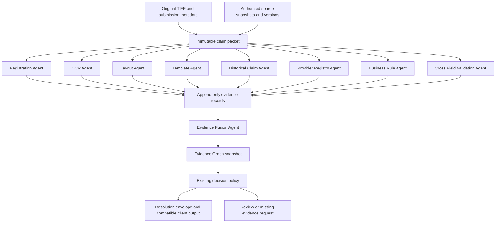

# CDP: Agentic Claim Resolution Platform

Design proposal, 2026-09-14. Repository: ashishdat/CDP, feature/cdp-v3.

This document proposes architecture, migration, implementation sequencing, risk, effort and ROI. It authorizes no implementation. No claims were rerun and no runtime, algorithm, threshold or existing graph was changed.

## Design position

Build autonomous evidence producers around an immutable claim packet, then reconcile their observations through provenance-aware fusion and the existing decision policies. An agent here is a bounded worker with a defined evidence objective, permitted sources, execution budget and explicit stopping condition. It need not use an LLM. Deterministic services are the default.

Three outcomes require three separate contracts:

| Objective | Success means | What does not establish success |
|---|---|---|
| Operational completion | A claim reaches an auditable terminal outcome within its execution budget; successful resolution is measured separately | Returning a review envelope and calling it successful extraction |
| Ground truth | A particular fact has an applicable authoritative record or independent adjudication with provenance | Agreement among OCR, validators and derived rules |
| Independent evidence | Evidence has established source lineage that is distinct and relevant to the asserted fact | Different agents reading the same pixels |

The reported baseline is 39 final-claim completions out of 100, all requiring field review. Keep that metric unchanged for comparisons. A future 100% terminal-envelope rate would not be an improvement from 39% to 100% in claim resolution.

There is a constraint conflict in the request: fusion necessarily depends on producer outputs. Rules over extracted fields also require those fields. This design applies independence to peer evidence producers: they never call, await or consume sibling outputs. Fusion and decision are explicit downstream consumers. If output independence is required literally for every agent, evidence fusion cannot exist.

## Architecture

Ingestion establishes claim, document and page identities without forcing a single classification or template. The packet contains original page hashes, dimensions, orientation metadata, source coordinate systems, submitted structured facts with their provenance, permitted source references, tenant scope, service dates when supplied, and pinned configuration versions. It contains no inferred sibling-agent outputs.

A coordinator dispatches producers, enforces deadlines and records terminal statuses. One producer failing does not cancel unrelated producers. Each execution has fixed inputs, agent versions and budgets. Missing assets, unsupported inputs and timeouts produce evidence-availability records rather than fabricated observations. Late evidence creates a new versioned assessment; it does not silently alter an issued decision. No unlimited retries or agent-to-agent conversation is required.

The initial deployment can use existing workers and storage. Nine agent responsibilities do not imply nine microservices or a new distributed framework.

## Agent responsibilities and independence

| Agent | Independent input | Evidence, confidence and reason | Boundary |
|---|---|---|---|
| Registration | Original page and eligible reference assets from the packet | Transform hypothesis, matches, safety verdict and original registration score | Does not select OCR text or establish field correctness; missing compatible assets remain unavailable |
| OCR | Original pages and its own existing provider capabilities | Every text observation, source bbox, provider score, alternatives and reason | Cannot require Registration Agent output; template-free OCR capability must be demonstrated before this path is activated |
| Layout | Original page | Regions, line/grid structure, spatial relations and existing detector scores | Structural evidence only; no inference that a field value is true |
| Template | Original page and versioned template catalog | Template hypotheses, supporting visual features, ambiguity and score | Cannot consume sibling OCR or registration; existing dependent selector cannot simply be renamed an independent agent |
| Historical Claim | Authorized source plus independently supplied lookup keys | Prior finalized facts, validity dates, record origin and identity-match evidence | Prior facts may be stale or CDP-derived; no match or absent lookup key means missing evidence |
| Provider Registry | Authorized provider source and independently supplied identifiers | Identity, source-supported attributes and applicable dates; match confidence | Registry identity does not prove a billed service occurred |
| Business Rule | Versioned existing rules and independently supplied structured facts | Applicable rule predicates, satisfied/violated/unassessable outcomes and cited inputs | Without facts, emits requirements or unavailable evidence; does not independently verify OCR |
| Cross Field Validation | Independently supplied structured claim/source facts | Explicit consistency relations, contradictions and missing operands | Arithmetic agreement is consistency, not a separate observation of reality |
| Evidence Fusion | All completed producer records and availability records | Reconciled hypotheses, provenance groups, conflicts, missing evidence and confidence applicability | Intentionally depends on producers; creates no new source observation |

Where an existing detector internally needs OCR or registration, preserve that dependency in its lineage and classify the output as derived evidence. Do not duplicate those calls privately and count their outputs as independent votes. Migration must identify which independent capabilities already exist and which proposed responsibilities cannot yet be activated without a separately approved change.

Strict producer independence has a real cost for TIFF-only claims: provider/history lookups may lack an identifier. Under this design they report missing keys. A future OCR-derived lookup would need an explicit dependency exception and retained query lineage; it must never be hidden behind an agent name.

The proposed nine agents also lack an independent source for some member facts and current service details. Future member/eligibility and relevant source-record access may be necessary. Historical claims and provider records cannot substitute for those facts.

## Evidence and fusion contract

Every observation retains an evidence ID, execution ID, document/page/field scope, asserted value or proposition, source record/image hash, coordinates, producer/version, source and effective timestamps, confidence value and meaning, reason, parent evidence IDs, and availability status. Unknown confidence is null, with a reason. Source reliability, OCR confidence, match confidence and calibrated correctness probability remain distinct quantities.

Preserve contradictory observations. Retain raw text separately from normalization. Geometry transformations carry source and target coordinate systems; fusion cannot compare boxes until their frames are reconciled. Evidence that cannot be mapped remains unresolved.

The graph records supports, contradicts, derived-from and uses relationships. Its provenance semantics can follow the distinction between entities, activities and agents described in [W3C PROV](https://www.w3.org/TR/prov-overview/). This is a conceptual mapping, not a requirement to adopt RDF or replace the existing graph implementation.

Fusion proceeds deterministically:

1. Verify identity, source integrity, applicable dates and coordinate frames.
2. Preserve competing field and template hypotheses rather than choosing an early winner.
3. Trace each assertion to source roots. A provider directory mirrored from NPPES and NPPES itself are one source lineage for that fact.
4. Separate observations from consistency checks and policy constraints. Apply existing rules to hypotheses downstream, recording all input dependencies.
5. Retain conflicts and missing evidence; apply existing decision policy only when its prerequisites are satisfied.
6. Publish a versioned graph snapshot and a decision-ready evidence view.

There is no majority vote across agents and no initial weighted confidence sum. Shared source ancestry establishes dependence in provenance; absence of shared recorded ancestry does not prove statistical independence. Any later probabilistic fusion would require calibration data and a separate design review.

## Decision and ground truth

Decision consumes supported facts, conflicts, availability and rule outcomes from the graph through the existing business-policy interface. It does not consume the OCR winner as unquestioned truth. The policy still governs disposition; introducing a graph must not quietly change acceptance rules.

For each field, return value/hypotheses, field confidence, confidence basis, evidence references, missing evidence and review reason. At claim level return claim confidence, status, critical unresolved fields, missing evidence, review reason, graph version and policy version. Preserve existing public response contracts through an adapter; new details can be a versioned companion artifact.

A field-confidence percentage means probability of a precisely defined correctness event only after validation supports that interpretation. Otherwise return null and an explicit uncalibrated score or evidence-coverage measure separately. Claim confidence requires its own defined target, such as correctness of disposition; do not average field scores or multiply correlated probabilities.

Ground truth must be established per fact and effective date. A registry can corroborate identity. A code catalog can establish code validity. Neither proves the service occurred. Source conflicts require authoritative resolution or review. Keep evaluation labels isolated from runtime reference inputs to prevent leakage.

This design can reduce manual work through authoritative records and targeted review, but cannot eliminate the need for independently established outcomes when measuring accuracy. AutoTruth remains an automated assessment, not a validation label. Until trusted evaluation outcomes exist, accuracy and false-accept rates remain unmeasured.

## Migration and implementation plan

| Step | Work | Reviewable exit condition |
|---|---|---|
| 1. Freeze contracts | Inventory current APIs, outputs, source dependencies and baseline denominators; define packet and evidence mappings | Dependency map identifies every agent that cannot yet run independently; no runtime change |
| 2. Prove source access | Use existing reference interfaces for one provider source and one authorized historical source; verify origin and identity binding | Applicable external records exist for a bounded set; no-source and ambiguous-identity cases are demonstrated |
| 3. Adapt producers | Wrap existing capabilities one at a time, retaining scores and behavior; use fixtures before live evaluation | Each adapter runs from the packet without sibling outputs; unsupported capability is explicit |
| 4. Shadow fusion | Map evidence into the existing graph; reconcile provenance and coordinates without changing decisions | Every output can be traced to original observations; duplicates never masquerade as new sources |
| 5. Decision bridge | Feed graph-backed facts to existing policy and compatible output assembly | Existing contracts preserved; missing/conflicting prerequisites route through existing review behavior |
| 6. Validate | Use independently established outcomes and a frozen holdout; measure completion, review, error and cost separately | Approved acceptance criteria met; calibration reported only where measurable |
| 7. Roll out | Enable per tenant/document family after review, with versioned artifacts and rollback to the legacy path | Measured improvement without unacceptable decision error, latency or compatibility regression |

One adapter or integration boundary per PR. No broad rewrite commit. Keep legacy execution available through migration; do not delete it before parity and operational acceptance. Existing registration, OCR and rule algorithms are reusable components rather than targets for tuning.

The first useful vertical slice is one claim with original-image evidence, an independently maintained provider fact, explicit lineage and a policy-consistent resolution envelope. Success includes an honest review outcome when critical evidence is absent. This slice proves integration, not production accuracy.

Future acceptance tests should cover packet replay, deterministic outputs excluding recorded timing, source outages, missing lookup keys, wrong-person matches, conflicting facts, stale snapshots, shared-origin evidence, unmappable coordinates, unchanged API behavior and review routing. This task executes none of them.

## Risk analysis

| Risk | Consequence | Design response |
|---|---|---|
| Circular or correlated evidence | False confidence from repeated observations | Trace source roots; distinguish derivation from independent corroboration |
| Wrong identity binding | Correct external facts attached to the wrong claim | Preserve lookup-key origin and ambiguity; use existing identity requirements |
| Missing independent lookup keys | External agents cannot contribute | Report missing keys; make any future sequential enrichment dependency explicit |
| Unequal score semantics | Misleading field/claim percentages | Typed confidence and null calibrated probability until measured |
| Partial completion inflation | Apparent improvement without more resolved claims | Separate terminal artifacts, final-claim completion and straight-through resolution |
| Temporal mismatch | Old facts applied to current services | Pin source versions and effective dates |
| Parallel execution cost | More OCR calls and higher resource demand | Fixed budgets, source-level caching scoped by version and tenant, bounded concurrency |
| Hidden capability rewrite | Agents violate independence or change algorithms | Adapter capability audit before implementation; retain unavailable states |
| Source outage or absent authority | No ground truth despite complete software | Source readiness gates; uncertainty preserved in decision output |
| Data exposure or cross-tenant reuse | Claim records attributed or disclosed incorrectly | Tenant-scoped source access and artifact references; existing access controls |

## Engineering effort

Planning estimate for a bounded first production scope, assuming existing capabilities can be adapted and two authorized sources are accessible:

| Workstream | Engineer-weeks |
|---|---:|
| Contracts and dependency audit | 2-3 |
| Existing producer adapters | 3-5 |
| Two independent source integrations | 5-8 |
| Fusion/provenance integration | 3-5 |
| Decision and API compatibility | 2-3 |
| Validation and calibration assessment | 3-5 |
| Controlled rollout and operational checks | 2-3 |
| **Total** | **20-32** |

With three engineers, allow roughly 10-14 calendar weeks after source access, depending on sequential review gates. This is an estimate, not a delivery commitment. Domain reviewers and source owners are additional part-time roles. Procurement, large-scale truth creation, new extraction capabilities and broad payer integration are excluded; their discovery would require re-estimation.

## ROI and priorities

No measured gain can be attributed to the proposed architecture. Rank investments initially by testable value and prerequisite availability:

| Priority | Investment | Expected value mechanism | Risk / cost | Evidence required to justify expansion |
|---|---|---|---|---|
| 1 | Authoritative source access and provenance | Adds facts that more image agents cannot supply | Medium / medium-high | Applicable, correctly linked external records for unresolved fields |
| 2 | Independent producer scheduling | Allows useful work when a sibling capability is unavailable | Medium / medium | Previously blocked claims gain usable evidence without bypassing safety |
| 3 | Graph-backed decision bridge | Converts provenance and conflicts into consistent review reasons | Medium-high / medium | Stable policy outcomes, fewer unsupported decisions and less review effort |
| 4 | Targeted source-backed adjudication | Establishes evaluation outcomes and calibrates confidence | Medium / medium-high | Independent holdout labels and measured decision error |
| 5 | Additional specialized agents | Addresses demonstrated evidence gaps | High uncertainty / variable | Incremental evidence beyond existing source groups and positive measured economics |

Estimate monthly net benefit as avoided review labor plus incremental contribution from newly resolved claims plus avoided rework, minus added compute, source fees, operating effort and expected error loss. Count each benefit once. Break-even months equal implementation cost divided by positive monthly net benefit. Populate the model from measured claim volume, review minutes, labor cost, resolution gain and error outcomes; none is assumed here.

Evaluate final-claim completion, independently corroborated field coverage, straight-through resolution, review minutes, false accepts/rejects, mean/P95 latency and cost per resolved claim. Retain the same sample and denominator for comparable operational metrics; use a separate frozen truth-backed holdout for accuracy. Do not equate source agreement with accuracy gain.

The primary investment decision is whether CDP can obtain applicable independent facts. Autonomous execution can improve resilience, and fusion can expose uncertainty, but neither creates missing truth. Approve source readiness and the bounded vertical slice before funding all agent integrations.

## Repository basis

This proposal uses the existing [connector roadmap](EvidenceConnectorRoadmap.md), [reference contracts](packages/reference_enrichment/contracts.py), [reference configuration](config/reference_enrichment.yaml), [verification policy](config/reference_verification_policy.yaml), [snapshot support](packages/reference_data/snapshot.py), [deterministic evidence](packages/deterministic_evidence/service.py), and [decision contracts](packages/evidence_decision/contracts.py). The prior roadmap found configured providers disabled/unauthorized and no operational snapshots at their configured locations; it did not establish external production access.

This document is the only deliverable created for this design task. Implementation, runtime execution and rollout remain proposals for review.
