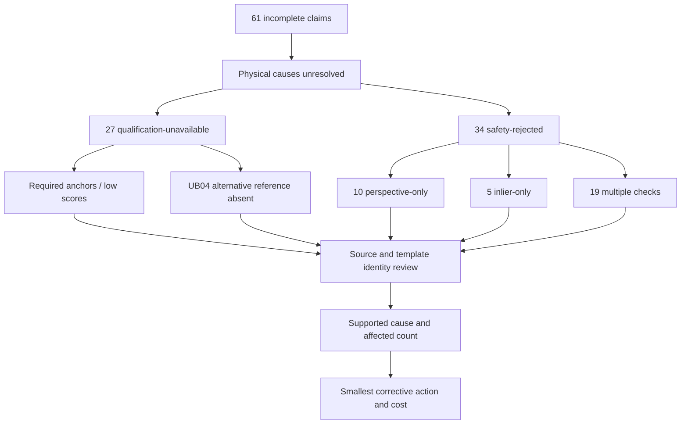

# CDP V1.5 — Minimum Work to Exceed 90% Completion

CTO systems analysis and approval proposal | 14 September 2026 | ashishdat/CDP

## One-page CTO decision

**Do not approve another platform redesign. Approve a short evidence-closing work package, then the smallest verified fixes.** The saved run identifies where all 61 incomplete claims stopped, but does not establish their physical causes or demonstrate that at least 52 are recoverable. No defensible minimum implementation or guaranteed >90% roadmap can yet be priced.

On this 100-claim cohort, **>90% means at least 91 completions**, requiring 52 of the current 61 failures to complete without losing existing successes: **85.25% recovery**. Fixing selection alone has a theoretical ceiling of 66%; fixing the selected safety cohort alone has a ceiling of 73%. Both cohorts must contribute, or an independently justified manual/source-resolution process must be explicitly counted separately.

The minimum next work is to finish the existing source review, establish correct page/form identity for the failed claims, validate source/template compatibility for the fifteen single-gate failures, and identify authorized missing assets. Use the existing report surfaces. Do not build another diagnosis engine or root-cause graph for this audit.

Freeze working extraction algorithms and current safety thresholds while this work proceeds. Independently verify any proposed cause before choosing one narrow implementation change. No recommendation here authorizes lowering gates, expanding OCR calls, adopting weighted template scoring or replacing registration.

**Separate operational constraints:** OCR averaged 96.47 seconds among reached claims. Completion repairs may increase average compute time even without a performance regression. Independent evidence remains absent; that affects verification and review, not the observed upstream failure count. Ground truth is unavailable, so accuracy gains and false-accept risk cannot be quantified.

Initial approval request: **7–12 engineering days** for artifact/source reconciliation and a repairable-cohort plan, with claim-domain reviewers assigned. This is a planning allowance, not measured effort or a promise of recovery. Implementation funding is conditional on the findings. Stop promising >90% if fewer than 52 failures have credible resolution paths under the accepted definition.

## 1. Scope, method and evidence

No application code changed, no claim rerun, no benchmark, and no threshold or algorithm modified. This task inspected every saved ApplicationResult in `runs/anchor-normalization-100-01`, checked its document identity against the fixed manifest, and produced [V1_5_FailedClaimAnalysis.json](V1_5_FailedClaimAnalysis.json). All 100 identity checks passed; 61 failed cases are individually recorded with source hashes, selected-page/template references, available safety measures and observed reasons.

Measured commit: `c6dbdea545da5a177a219a588ecbae3a67c54c41`. Manifest SHA256: `07369b58a4f33229e8e2a0d1648b9ed64fa99d38d781b37d20ffce7fadae5e72`. This cohort has 100 claims and 284 pages, concurrency one and no retries. No metrics from another run are blended into its failure attribution.

Evidence references: E1 = this per-claim audit; E2 = [AnchorNormalizationDeltaReport.json](AnchorNormalizationDeltaReport.json); E3 = [SelectionRootCauseReport.json](SelectionRootCauseReport.json); E4 = [QualificationReview.json](QualificationReview.json); E5 = [QualificationBreakdown.json](QualificationBreakdown.json); E6 = [EvidenceConnectorRoadmap.md](EvidenceConnectorRoadmap.md); E7 = current EvidenceGraph.json file size and prior evidence provenance findings; E8 = repository status and saved contract-fix history.

E4 is still `AWAITING_HUMAN_REVIEW`. Saved rejection reasons are operational evidence, not adjudicated root causes. The audit therefore marks underlying physical cause UNDETERMINED for all 61 until independent source evidence supports a stronger conclusion. This does not discard the specific observed mechanisms.

## 2. Every-stage system analysis and subsystem ranking

Rank is priority for investigating completion impact, not a ranking of software quality. Complexity is a planning judgment. Latencies are saved stage wall-time observations, not dollars, CPU billing, exclusive profiler time or accuracy measurements. Registration timing includes its application-stage selection work. Skipped stages are not failures.

| Rank / stage | Purpose and business value | Observed failure / exposure | Mean seconds (n) | Complexity | Recovery potential | Independent evidence today? | Business dependency |
|---|---|---|---|---|---|---|---|
| 1 Selection | Select applicable page/template | 27 unavailable /100 | Included in registration; not separately measured | Medium | Unknown; at most 27 existing failures | Not established | Every current aligned route |
| 2 Registration | Safe canonical alignment | 34 failed /73 selected =46.58%;39 pass | 5.220 (100 stage calls, including unavailable selection) | High | Unknown; at most34 selected failures | No external truth | Template-dependent geometry |
| 3 Classification/page identity | Identify eligible document pages | 0 execution failures /100; semantic accuracy unknown | 4.958 (100) | Medium | Potential contributor to selection; no attributed recoveries | No reviewed identity truth | Correct source/page route |
| 4 Recovery operations | Resolve supported causes | No measured general recovery trial in cohort | Unmeasured | Low for manual existing-route repair; high for generic framework | 0–61 theoretical, not predicted | Case-specific review needed | Restoring availability |
| 5 OCR | Observe field text | 0 execution failures /39 reached;61 skipped | 96.472 (39) | High | No observed failed-claim recovery benefit from OCR-only changes | No independent confirmation | Field values; dominant measured time |
| 6 Artifact handoffs/ExtractionResult | Produce reusable consistent result | 39 downstream completions; no separate stage timing | Unmeasured separately | Low–medium | Historical handoff already fixed; no current attributed failure | Not applicable | Downstream resume |
| 7 Geometry | Canonical field regions | 0/39 reached;61 skipped | 0.044 (39) | High | No observed completion defect | No localization truth | Crop integrity |
| 8 Validators | Syntax/consistency status | 0 execution failures /39; invalid fields are separate | 0.039 (39) | Medium | No observed completion defect; quality unknown | Derived checks only | Field review and rules |
| 9 Ranking | Select candidate under policy | 0/39;61 skipped | 0.075 (39) | Medium | No observed completion defect | OCR-derived | Selected observations |
| 10 Decision | Existing business disposition | 0/39; all completed claims review-required | 0.561 (39) | High policy complexity | No upstream completion gain established | Independent references absent | Claim disposition |
| 11 Evidence / FinalClaim | Preserve provenance and deliver output | 0/39;61 skipped | 0.027 (39), evidence stage | Medium | No current completion failure | Evidence is not itself independent | Auditable final artifact |
| 12 Telemetry/reporting | Execution visibility | Failure frequency not separately measured | Unmeasured | Medium | Indirect; use existing records | Not a truth source | Diagnosis and measurement |
| 13 Evidence Graph | Represent provenance | No evidence of completion failure caused by graph | Unmeasured; file723,854,755 bytes | Medium–high if scaled | Zero demonstrated upstream benefit | No proven independent observations | Investigation, not extraction prerequisite |
| 14 Reference enrichment | External corroboration | Providers not operationally enabled in reviewed config | Unmeasured | Source dependent | No direct path to upstream repairs | Unavailable operationally | Verification/HITL, not registration |

Geometry/ranking/validator timing totals are small compared with OCR. That is evidence against optimizing them for latency now, not proof that their algorithms are universally correct. Execution success in 39 selected survivors cannot establish behavior on the 61 blocked claims.

## 3. Failure inventory and root-cause clustering

Exclusive observed cohorts: selection unavailable27; perspective-only10; inlier-ratio-only5; multiple-safety-check failures19. These are review cohorts, explicitly not ground-truth root-cause clusters.

Overlapping safety indicators among34 claims: perspective29; low inlier ratio22; invalid corners14; low coverage13; rotation12; scale8; insufficient inliers6. They sum above34 because one claim may fail several checks. Earlier cheap-route failures in a trace are not counted as separate failed claims; the audit uses the recorded application terminal outcome.

Perspective-only claim indices:18,39,42,49,50,51,56,66,73,74. Inlier-only:1,21,24,44,46. Each claim's complete saved reason is in the ledger. A single failed gate does not prove that lowering that gate would produce a correct result.

### Top20 root-cause evidence register

Only supported causal findings may become implementation requirements. The following is an ordered register of observed mechanisms and candidate explanations, not twenty fabricated proven causes. U means unknown; frequencies refer to affected candidates/cohorts where stated, not exclusive causes.

| # | Cause / candidate explanation | Evidence and frequency | Physical cause established? / next evidence |
|---|---|---|---|
| 1 | Underlying cause unresolved |61 failed claims lack independent causal adjudication in audited artifacts |Yes: uncertainty established; complete source review |
| 2 | Missing UB04 reference |E3:27 claims contain blocked UB04 alternatives |Asset absence established; affected claims actually UB04 is U |
| 3 | Perspective inconsistency |29 selected failures include safety indicator |Mechanism only; compare page/reference identity and transform support |
| 4 | Required anchor not detected |E3:27 unavailable claims;4 have a score-passing candidate |Observed match absence; visible absence versus detector miss U |
| 5 | Poor qualifying evidence |23 unavailable claims all CMS anchor scores below threshold |Score condition observed; physical explanation U |
| 6 | Insufficient accepted correspondence ratio |22 selected failures |Mechanism only; wrong matching/source/template cause U |
| 7 | Invalid transformed corners |14 selected failures |Mechanism only; source/reference geometry evidence required |
| 8 | Insufficient spatial coverage |13 selected failures |Mechanism only; distribution explanation U |
| 9 | Rotation incompatibility |12 selected failures |Mechanism only; true page orientation cause U |
| 10 | Scale incompatibility |8 selected failures |Mechanism only; true scale/template cause U |
| 11 | Insufficient inliers |6 selected failures |Mechanism only; source/matching explanation U |
| 12 | Wrong selected page |Potential across failed cohort; source-adjudicated count U |Review actual pages against claim composition |
| 13 | Poor scan / cropping |Count U |Visible source evidence required; low scores insufficient |
| 14 | Template evolution |E3:0 established; actual count U |Authoritative version comparison required |
| 15 | Unknown/unsupported document |E3:171 Unknown pages in unavailable cohort; true unsupported claims U |Unknown classification is not unsupported truth |
| 16 | OCR recognition defect causing qualification failure |Count U |Compare saved OCR with visible anchors; no rerun needed |
| 17 | Template/layout detector defect |Count U |Qualified identity and expected detector behavior needed |
| 18 | Business-rule failure |0 terminal failures at decision in39 reached |No evidence it causes these61 upstream failures |
| 19 | Historical absence |Independent history unavailable; causal completion frequency0 established |Verification gap, not upstream cause |
| 20 | Human error / data quality beyond above |Count U |Do not assign without provenance or observed input error |

### Root-cause tree

Evidence→frequency→impact→cost: E3 qualification failures affect27 completions; E1 safety failures affect34; final recovery bounds are27 and34, not promises. Physical-cause review is budgeted7–12 engineering days plus domain review. Fix cost remains U until the supported cause is known. Categories cannot be summed after branching because indicator cohorts overlap.

## 4. Counterfactual simulation

Define “10% improves” explicitly. Primary interpretation: recover10% of the currently failed eligible cohort, not lower a threshold by10%. Expected fractional claim counts are planning expectations; actual outcomes are integers.

| Change | Conditional completion | Assumption / limit |
|---|---:|---|
| Selection recovers10% of27 |40.44% |2.7 newly selected × current conditional registration/downstream rate39/73; transportability unproven |
| Selection recovers10%, all recovered pass downstream |41.70% |Optimistic ceiling for this scenario |
| Registration recovers10% of34 |42.40% |3.4 additional claims complete; no downstream regression |
| OCR recovers10% of observed OCR failures |39.00% |Observed OCR execution failures0; no assumption about recognition accuracy |
| Geometry recovers10% of observed geometry failures |39.00% |Observed failures0; blocked cohort remains blocked |
| Generic recovery converts10% of61 end-to-end |45.10% |Hypothetical conversion; no recovery trial establishes it |
| Historical connector only |39.00% direct upstream effect |No extraction repair path; review benefit unknown |
| Provider connector only |39.00% direct upstream effect |Same limit; identity corroboration not missing extraction |

Alternative relative-success-rate interpretation: selection success73% ×1.10=80.3%; at39/73 conditional pass gives42.9% overall. Conditional registration rate39/73 ×1.10 yields42.9% overall with73 selected. A ten-percentage-point improvement is different: selection to83% yields44.34% using that same conditional assumption; conditional registration +0.10 yields46.3%. None changes thresholds or predicts actual repairability.

If “OCR10%” means latency reduction rather than availability, fixed-cohort saved OCR time falls376.24 seconds, about3.76 seconds per submitted claim, assuming stage timing reduction transfers directly. It changes no observed completion outcome. A10% geometry time reduction saves0.00173 seconds per submitted claim. These are separate performance scenarios, not completion ROI.

Highest quantified leverage is in selected registration failures and qualification blockers, but **highest realized ROI is not identifiable** without cause-specific recovery probability and cost. Small, source-supported repairs beat generic architecture only if they actually exist. Review to establish that is the immediate recommendation.

## 5. Fifty-action engineering disposition and ROI register

This is a ranked review of50 candidate actions, **not50 recommended implementations**. Evidence does not support50 separate fixes. Rank reflects decision priority. Only rows marked NOW are currently supported actions; GATE means implement only after cause evidence and review; DEFER/REJECT are not recommendations to build.

Columns: C = expected completion gain in percentage points; A = expected accuracy gain; H = expected HITL reduction; L = expected latency change. U = unknown, not zero. C=0 for a review/documentation activity means no direct claim execution effect; it may enable a later repair. Costs are planning engineering days for the narrow action, exclude domain reviewer time/access delay, and overlap; do not sum them. Financial ROI score is U when causal gain, value or cost is unmeasured. N/A means an explicit non-investment, not a disguised positive score. Latency0 means no runtime change; U means unmeasured runtime effect.

For a later approved fix, use ROI=(incremental correct completions×value + avoided review cost − incremental operating/error cost)/engineering cost. No numeric probability, money value or gain is fabricated here. Shared bound B27 means0–27 theoretical completions; B34 means0–34; bounds overlap and are not expected gains.

| # / disposition | Description | Root-cause basis | Business impact | Cost days | Risk | Dependencies | C | A | H | L | ROI score |
|---|---|---|---|---:|---|---|---|---|---|---|---|
| 1 NOW | Finish existing Top25 source review |E4 pending identity/cause evidence |Establish repairable cases |2–4 |Low |Reviewer, original pages |0 |0 |0 |0 |U |
| 2 NOW | Review remaining2 selection cases |E1/E3 uncovered review scope |Complete27-case accounting |0.5–1 |Low |1 |0 |0 |0 |0 |U |
| 3 NOW | Review10 perspective-only cases |E1 single observed gate |Find smallest supported safety-cohort repair |1–2 |Low |Sources/references |0 |0 |0 |0 |U |
| 4 NOW | Review5 inlier-only cases |E1 single observed gate |Distinguish source/template/matching issue |1–2 |Low |Sources/references |0 |0 |0 |0 |U |
| 5 NOW | Review19 multi-gate cases |E1 overlapping symptoms |Avoid fixing a downstream symptom |2–4 |Low |Sources/references |0 |0 |0 |0 |U |
| 6 NOW | Verify UB04 source/version availability |E3 missing asset |Determine whether exact asset repair is feasible |0.5–1 |Low |Authorized asset owner |0 |0 |0 |0 |U |
| 7 NOW | Mark supported versus unsupported claim identity |E3 Unknown is not truth |Honest supported-scope estimate |1–2 |Low |1–5 |0 |0 |0 |0 |U |
| 8 NOW | Freeze cohort and metric denominators |E2 aligned sample |Prevent false improvement claims |0.5–1 |Low |E1 manifest |0 |0 |0 |0 |U |
| 9 NOW | Separate queued/reviewed/completed outcomes |E2 review denominator |Prevent automation inflation |0.5–1 |Low |Existing reports |0 |0 |0 |0 |U |
| 10 NOW | Establish release baseline from Git |E8 uncommitted work |Reproducible qualification |1–2 |Medium |Review local source scope |0 |0 |0 |0 |U |
| 11 NOW | Retain regression cohort for39 successes |E1 survivors |Protect existing business output |0.5–1 |Low |Saved outputs |0 |0 |0 |0 |U |
| 12 NOW | Identify source-supported critical truth subset |E6 ground truth gap |Permit correctness assessment |1–3 |Medium |Domain/source owners |0 |0 |0 |0 |U |
| 13 NOW | Record OCR latency by reached cohort |E1 96.47s |Budget completion growth honestly |0.5–1 |Low |Existing timings |0 |0 |0 |0 |U |
| 14 NOW | Define minimum repair portfolio from adjudication |E1/E4 unknown repairability |Select only necessary fixes |1–2 |Low |1–7 |0 |0 |0 |0 |U |
| 15 GATE | Restore exact missing UB04 asset |E3 confirmed missing route asset |Enable affected route only if relevant |1–3 |Medium |6, authoritative hash/version |U≤B27 |U |U |U |U |
| 16 GATE | Correct proven wrong page metadata |E3 possible identity issue |Restore correct source routing |1–3 |Medium |Reviewed wrong-page cases |U≤B27+B34 |U |U |U |U |
| 17 GATE | Correct proven wrong template reference |E1/E3 compatibility unresolved |Restore intended existing route |1–3 |Medium |Source-adjudicated mismatch |U≤B27+B34 |U |U |U |U |
| 18 GATE | Repair proven asset packaging/configuration defect |E3 asset absence |Prevent verified asset unavailability |1–3 |Medium |Exact defect reproduced |U≤B27 |U |U |U |U |
| 19 GATE | Fix only an adjudicated anchor recognition contract defect |E3 four score-pass cases |Potential qualification recovery |1–3 |Medium |Saved OCR/source proof; normalization already accepted |U≤4 |U |U |U |U |
| 20 GATE | Fix a proven selection rule implementation mismatch |E3/E5 unavailable cohort |Correct behavior against existing specification |2–5 |High |Independent expected behavior |U≤B27 |U |U |U |U |
| 21 GATE | Fix proven safety-input/coordinate contract defect |E1 safety symptoms |Restore valid inputs without gate changes |2–5 |High |Explicit coordinate/lineage proof |U≤B34 |U |U |U |U |
| 22 GATE | Request readable source for proven poor scan |Root cause U today |Resolve external data defect |0.5–1 workflow |Medium |Visible poor source, source owner |U |U |U |U |U |
| 23 GATE | Use existing manual handling for proven unsupported claims |E3 unknown versus unsupported unresolved |Business resolution outside automated extraction |1–2 workflow |Medium |Reviewed unsupported identity |U, separate metric |U |Negative likely |Longer likely |U |
| 24 GATE | Reuse corrected existing route once per proven cause |No general recovery trial |Measure actual recovery yield |2–4 |Medium |Approved15–22, existing runner |U |U |U |U |U |
| 25 GATE | Regression verification and fixed100 qualification after fix |E2 established comparison protocol |Accept or reject one repair |1–2 |Low |One approved tested fix |0 direct |0 direct |0 direct |0 |U |
| 26 DEFER | Tune global registration thresholds |E1 safety failures not truth |Risk false acceptance |U |High |Independent safety truth |U |U |U |U |N/A |
| 27 DEFER | Change perspective acceptance |29 affected;10 sole gate |No proof current limit wrong |U |High |Source/transform adjudication |U |U |U |U |N/A |
| 28 DEFER | Change inlier-ratio acceptance |22 affected;5 sole gate |Could admit wrong matches |U |High |Correspondence truth |U |U |U |U |N/A |
| 29 DEFER | Change coverage acceptance |13 affected |No causal justification |U |High |Spatial/source truth |U |U |U |U |N/A |
| 30 DEFER | Tune matcher/descriptor/RANSAC |E1 mechanism symptoms only |No identified common algorithm defect |U |High |Specific reviewed defect |U |U |U |U |N/A |
| 31 DEFER | Rewrite registration |E1 39 accepted |Large scope without proven cause |U |High |Failure-proof replacement case |U |U |U |U |N/A |
| 32 DEFER | Rewrite geometry |0/39 execution failures |No direct completion evidence |U |High |Observed defect |0 demonstrated |U |U |U |N/A |
| 33 DEFER | Rewrite OCR |0/39 execution failures |Latency issue does not justify rewrite |U |High |Scoped profiler/quality evidence |0 demonstrated |U |U |U |N/A |
| 34 DEFER | Add more OCR providers |E1 reached OCR succeeds |More cost; no upstream repair evidence |U |Medium |Proven provider-specific defect |0 demonstrated |U |U |U |N/A |
| 35 DEFER | OCR latency optimization |E1 96.47s reached mean |Separate latency workstream |U |Medium |Provider timing, behavior parity |0 demonstrated |U |U |U |N/A |
| 36 DEFER | Ranking redesign |0/39 execution failures |No completion blocker |U |High |Independent candidate truth |0 demonstrated |U |U |U |N/A |
| 37 DEFER | Validator rewrite |0/39 execution failures |Could change business behavior |U |High |Verified rule defect |0 demonstrated |U |U |U |N/A |
| 38 REJECT | Relax decision rules to reduce review |E2 all39 review-required |Metric gaming without truth |U |Critical |Not authorized |0 upstream |U |U |U |N/A |
| 39 DEFER | Historical connector for completion target |E6 absent source |Useful only after independent access |U |Medium |Authorized noncircular history |0 direct |U |U |U |N/A |
| 40 DEFER | Provider connector for completion target |E6 absent source |Identity corroboration, not upstream repair |U |Medium |Authorized source and identity |0 direct |U |U |U |N/A |
| 41 DEFER | Member connector portfolio |E6 absent source |Verification roadmap, not minimum availability fix |U |Medium |Source access |0 direct |U |U |U |N/A |
| 42 DEFER | ICD/CPT/payer connector expansion |No upstream rule failures |Rule evidence not extraction recovery |U |Medium |Source authority/entitlement |0 direct |U |U |U |N/A |
| 43 REJECT | More graph algorithms or graph database |E7 no independent facts |Cannot create missing truth |U |High |No current business case |0 demonstrated |U |U |U |N/A |
| 44 REJECT | General agent/framework platform |E1 localized failure cohorts |Scope exceeds supported need |U |High |No current business case |U |U |U |U |N/A |
| 45 REJECT | New diagnosis engine/root-cause graph now |E4 unfinished review |Automates uncertain attribution |U |High |Reviewed taxonomy not available |0 direct |U |U |U |N/A |
| 46 REJECT | Blind stage-by-stage recovery ladder |No recovery trial |Cost and unsafe dependency risk |U |High |Cause-supported strategy absent |U |U |U |U |N/A |
| 47 DEFER | Weighted template signature replacement |Prior experiment inconclusive;E5 no additive weights |No validated acceptance gain |U |High |Independent comparison |U |U |U |U |N/A |
| 48 REJECT | AutoTruth as certified truth |Independent truth unavailable |Circular evaluation |U |Critical |Cannot substitute for truth |0 |U |U |0 |N/A |
| 49 DEFER | Online learning/self-tuning |No independent labels |Corrupts production feedback |U |Critical |Governed validated data first |0 demonstrated |U |U |U |N/A |
| 50 DEFER | Microservices/multi-region/replatforming |No scale evidence for61 failures |Unrelated complexity |U |High |Measured scale/SLO requirement |0 demonstrated |U |U |U |N/A |

Rows15–24 are conditional options, not evidence that those defects exist. Their bounds are exposure caps, not forecasts or additive opportunities. Completing the register must not be mistaken for funding all50 items.

## 6. What should not be built

Do not implement the currently proposed agentic extraction platform, seven-platform decomposition, general capability framework, automated diagnosis/root-cause graph, stage-driven recovery ladder, new graph algorithms/database, product-based confidence engine, speculative template signature scorer, broad connector portfolio, online learning or multi-region platform as the V1.5 completion fix. Their prerequisites or causal business cases are absent in this cohort. They are represented in rows26–50 so proposals cannot quietly return under new names.

Do not build more post-hoc diagnostic reports when the existing review packet is unfinished. Do not rebuild working registration, geometry, ranking or validators. Do not mistake a 724MB graph artifact for production evidence scale requiring a graph platform; first establish its operational role and marginal value. Preserve artifacts needed for audit; deletion is not authorized.

## 7. Practical V1.5 roadmap

**Gate A — close evidence (7–12 engineering days, overlapping rows1–14):** finish61-case source review using existing tools, identify document/page truth, validate asset ownership, reconcile metric denominators and mark causes known/unknown. Domain reviewer effort is additional and must be scheduled. Deliver a cause-to-claim list and a verified repairability bound.

**Gate B — select minimum repair set:** if a small source/configuration/contract correction explains a reviewed cohort, implement only it through current code and tests. Budget each selected fix after reproduction; provisional narrow-fix ranges in the register are not a total commitment. No threshold change without independent correctness proof and policy review.

**Gate C — qualify once after each approved change:** preserve the fixed100sample and39 successes; run relevant tests then the accepted comparison protocol as a future authorized task. Count actual end-to-end completions, quality changes, review outcomes and latency. This analysis performs no runs.

**Gate D — decide feasibility:** >90 requires91 results. Stop additional implementation when evidence shows fewer than52 failures can be recovered under scope. Request source remediation or explicitly revise scope; do not relabel unsupported cases or manual queues as automated completion.

**Gate E — operational hardening only after demonstrated gain:** release reproducibility, exact asset packaging, restore/resume contract regression checks and explicit existing manual handling. Address the separate96.47s OCR-time concern with profiling only if latency is a release requirement. No opportunistic refactoring.

The smallest defensible engineering commitment today is evidence closure, not a guessed algorithm fix. A >90% completion implementation estimate is **not identifiable from saved evidence**.

## 8. When V2 should start

Do not use arbitrary percentages as permission for redesign. Require these objective decision gates:

- V1.5 fixed-cohort performance is reproducible, with independently reviewed cause and supported-document coverage. A suggested floor is >80% completion (at least81/100), but this is a proposed business gate, not an empirical law.
- Remaining failures demonstrate a common capability limitation that narrow V1 fixes cannot address economically. The new architecture must name that limitation and its predicted marginal value.
- A versioned independent truth subset covers critical fields and relevant failure/success slices, with label coverage and uncertainty reported.
- For an evidence-focused V2, authorized independently applicable evidence covers a proposed >50% of critical facts and a read-only pilot demonstrates verified value. Do not count connector names or OCR-derived records.
- Any proposed >30% auto-verification gate has an approved denominator and independently checked error rate; absence of such a metric is not repaired by assigning artificial confidence.
- Source rights, policy owners, latency/cost budget, release/rollback and API compatibility are funded and testable.

If V1.5 cannot exceed80 because an independently proven structural limitation exists, that can justify a bounded V2 proposal before the numerical floor. Conversely, exceeding80 does not justify a rewrite if small fixes still dominate ROI.

## 9. Technical debt disposition

| Subsystem | Disposition now | Evidence-based boundary |
|---|---|---|
| Registration |Freeze algorithm/thresholds; repair only proven input/contract defect |34 failures need cause proof;39 successes to preserve |
| Geometry |Freeze |No reached execution failures; negligible measured time |
| OCR |Freeze behavior; defer separate latency work |No observed failures;96.47s warrants a separate cost gate |
| Ranking |Freeze |No reached execution failure and no independent selection truth |
| Validators |Freeze |Validation status is not execution failure; no proven rule defect |
| Decision |Freeze business policy |Review requirement cannot be removed to manufacture completion |
| Evidence |Freeze runtime |No observed execution blocker |
| Telemetry |Freeze format; refactor only demonstrated data-contract bug |Existing records suffice for this audit |
| Recovery |Defer generic engine; use existing reviewed/manual routes |No measured general recovery benefit |
| Evidence Graph |Freeze; defer expansion |No independent evidence; size not a completion cause |
| Template/source packaging |Conditional narrow correction |Missing UB04 reference established, applicability unknown |
| Repository artifacts |Review separation from release |Uncommitted sources/data exist; no deletion performed |

Delete now: **nothing**. There is no audited dead-code inventory establishing safe deletion. Proposed replacement frameworks should be rejected as work items, not interpreted as permission to delete existing runtime modules. Refactoring is not a default prerequisite to completion repair.

## 10. Risk register and three-year planning

| Risk | Practical control |
|---|---|
| Stage symptom treated as physical cause |Source-adjudicate before fixing |
| Single-gate cohort used to justify lower threshold |Independent correctness evidence required |
| 39 survivor successes extrapolated to61 failures |Conditional rates and transport assumptions explicit |
| Root-cause categories double counted |Exclusive claim ledger; overlapping indicators separate |
| Completion gains increase OCR cost |Reached-cohort latency/cost budget before expansion |
| Unsupported forms counted as software defects |Document truth and supported scope recorded |
| Source/graph agreement used as truth |Independent authority and provenance required |
| Report ROI presented as measured finance |Unknown gains/costs remain unknown |
| Manual handling hidden from review rate |Count every human touch and final disposition |
| Dirty workspace deployed as release |Explicit reviewed commit and reproducible artifacts |

**Year1:** V1.5 cause closure, narrow verified repairs, source remediation and fixed-cohort validation; establish usable truth and operational cost baselines. Release only measured improvements. Do not spend the year rebuilding frameworks.

**Year2:** expand supported forms/payers only when demand and reviewed failures justify it. Pilot independent sources for review reduction separately from completion. Make a V2 investment decision against the gates above, not calendar pressure.

**Year3:** scale the proven business capabilities and operating economics. Add architecture only for measured scale, source or workflow constraints. Continue correctness audits, source governance and safe releases. Multi-region and learning infrastructure require their own business cases.

This is an option-based roadmap, not a three-year construction plan. CTO recommendation: fund the evidence-closing gate now, require a repairable cohort and minimum fix set before implementation approval, and withhold a >90% delivery promise until evidence supports it.

## Per-claim audit appendix

Each row below is an independently identified saved execution. All61 have underlying physical root cause UNDETERMINED in this audit; their observed rejection mechanisms are retained verbatim. Full document IDs, paths, hashes and available measurements are in V1_5_FailedClaimAnalysis.json. No new image adjudication, OCR or runtime execution was performed.

| Claim | Document reference | Pages | Observed terminal mechanism |
|---|---|---:|---|
| 001 | Group A/M048DJJF.005 | 1 | low_inlier_ratio |
| 004 | Group A/M048DJJM.042 | 1 | low_inlier_ratio,unsafe_perspective_distortion |
| 016 | Group A/M048DJKN.023 | 1 | insufficient_inliers,low_inlier_ratio,low_coverage,unsafe_scale_change,unsafe_rotation,unsafe_perspective_distortion,invalid_transformed_corners |
| 018 | Group A/M048EJG7.020 | 1 | unsafe_perspective_distortion |
| 019 | Group A/M048EJGE.019 | 1 | NO_TEMPLATE_ABOVE_THRESHOLD |
| 020 | Group A/M048EJGE.043 | 1 | low_inlier_ratio,unsafe_perspective_distortion |
| 021 | Group A/M048EJGE.046 | 1 | low_inlier_ratio |
| 023 | Group A/M048EJI2.009 | 1 | low_inlier_ratio,low_coverage,unsafe_perspective_distortion |
| 024 | Group A/M048EJI2.019 | 1 | low_inlier_ratio |
| 029 | Group A/M048HJCX.013 | 1 | low_inlier_ratio,low_coverage,unsafe_rotation,unsafe_perspective_distortion,invalid_transformed_corners |
| 030 | Group A/M048HJDF.019 | 1 | low_inlier_ratio,low_coverage,unsafe_scale_change,unsafe_rotation,unsafe_perspective_distortion,invalid_transformed_corners |
| 032 | Group A/M048HJE5.016 | 1 | NO_TEMPLATE_ABOVE_THRESHOLD |
| 033 | Group A/M048HJE5.020 | 1 | NO_TEMPLATE_ABOVE_THRESHOLD |
| 034 | Group A/M048HJHO.007 | 1 | insufficient_inliers,low_inlier_ratio,unsafe_scale_change,unsafe_rotation,unsafe_perspective_distortion,invalid_transformed_corners |
| 035 | Group A/M048HJHO.020 | 1 | insufficient_inliers,low_coverage,unsafe_scale_change,unsafe_rotation,unsafe_perspective_distortion,invalid_transformed_corners |
| 039 | Group A/M048HJI6.010 | 1 | unsafe_perspective_distortion |
| 040 | Group A/M048HJI6.024 | 1 | low_inlier_ratio,unsafe_perspective_distortion |
| 041 | Group A/M048HJI6.025 | 1 | low_inlier_ratio,low_coverage,unsafe_scale_change,unsafe_rotation,unsafe_perspective_distortion,invalid_transformed_corners |
| 042 | Group A/M048IJJH.013 | 1 | unsafe_perspective_distortion |
| 043 | Group A/M048IJMP.001 | 1 | low_inlier_ratio,unsafe_perspective_distortion,invalid_transformed_corners |
| 044 | Group A/M048IJMP.002 | 1 | low_inlier_ratio |
| 045 | Group A/M048IJN2.003 | 1 | insufficient_inliers,low_inlier_ratio,low_coverage,unsafe_scale_change,unsafe_rotation,unsafe_perspective_distortion,invalid_transformed_corners |
| 046 | Group A/M048IJN2.005 | 1 | low_inlier_ratio |
| 047 | Group A/M048IJN2.008 | 1 | NO_TEMPLATE_ABOVE_THRESHOLD |
| 049 | Group A/M048IJN2.016 | 1 | unsafe_perspective_distortion |
| 050 | Group A/M048IJN2.022 | 1 | unsafe_perspective_distortion |
| 051 | Group A/M048IJN2.023 | 1 | unsafe_perspective_distortion |
| 054 | Group A/M048IJN2.029 | 1 | low_inlier_ratio,low_coverage,unsafe_perspective_distortion,invalid_transformed_corners |
| 056 | Group A/M048IJN2.048 | 1 | unsafe_perspective_distortion |
| 057 | Group A/M048IJPD.003 | 1 | low_inlier_ratio,low_coverage,unsafe_rotation,unsafe_perspective_distortion,invalid_transformed_corners |
| 058 | Group A/M048IJPD.013 | 1 | NO_TEMPLATE_ABOVE_THRESHOLD |
| 062 | Group A/M048JJH1.013 | 1 | low_inlier_ratio,low_coverage,unsafe_rotation,unsafe_perspective_distortion,invalid_transformed_corners |
| 065 | Group A/M048JJJG.001 | 1 | low_coverage,unsafe_rotation,unsafe_perspective_distortion,invalid_transformed_corners |
| 066 | Group A/M048JJJG.005 | 1 | unsafe_perspective_distortion |
| 069 | Group B/M048HJHK.005 | 3 | insufficient_inliers,low_inlier_ratio,unsafe_perspective_distortion |
| 070 | Group B/M048HJI8.002 | 3 | low_inlier_ratio,low_coverage,unsafe_scale_change,unsafe_rotation,unsafe_perspective_distortion,invalid_transformed_corners |
| 071 | Group B/M048IJBI.002 | 3 | NO_TEMPLATE_ABOVE_THRESHOLD |
| 072 | Group B/M048IJD5.002 | 3 | NO_TEMPLATE_ABOVE_THRESHOLD |
| 073 | Group B/M048IJKK.008 | 4 | unsafe_perspective_distortion |
| 074 | Group B/M048IJKK.010 | 4 | unsafe_perspective_distortion |
| 075 | Group B/M048IJM0.002 | 2 | NO_TEMPLATE_ABOVE_THRESHOLD |
| 076 | Group B/M048IJM0.003 | 2 | NO_TEMPLATE_ABOVE_THRESHOLD |
| 077 | Group B/M048IJM0.007 | 2 | NO_TEMPLATE_ABOVE_THRESHOLD |
| 079 | Group B/M048IJMD.003 | 3 | insufficient_inliers,low_inlier_ratio,low_coverage,unsafe_scale_change,unsafe_rotation,unsafe_perspective_distortion,invalid_transformed_corners |
| 082 | Group B/M048JJDJ.002 | 3 | NO_TEMPLATE_ABOVE_THRESHOLD |
| 083 | Group B/M048JJGM.001 | 6 | NO_TEMPLATE_ABOVE_THRESHOLD |
| 085 | Group B/M048JJJM.004 | 3 | NO_TEMPLATE_ABOVE_THRESHOLD |
| 087 | Group C/M048DJKQ.004 | 2 | NO_TEMPLATE_ABOVE_THRESHOLD |
| 088 | Group C/M048HJHZ.001 | 3 | NO_TEMPLATE_ABOVE_THRESHOLD |
| 089 | Group C/M048IJJX.003 | 2 | NO_TEMPLATE_ABOVE_THRESHOLD |
| 090 | Group C/M048IJL1.001 | 44 | NO_TEMPLATE_ABOVE_THRESHOLD |
| 091 | Group C/M048IJL1.003 | 3 | NO_TEMPLATE_ABOVE_THRESHOLD |
| 092 | Group C/M048IJL7.003 | 1 | NO_TEMPLATE_ABOVE_THRESHOLD |
| 093 | Group C/M048JJBP.001 | 2 | NO_TEMPLATE_ABOVE_THRESHOLD |
| 094 | Group C/M048JJBZ.001 | 69 | NO_TEMPLATE_ABOVE_THRESHOLD |
| 095 | Group C/M048JJDL.001 | 3 | NO_TEMPLATE_ABOVE_THRESHOLD |
| 096 | Group D/M048IJBP.001 | 3 | NO_TEMPLATE_ABOVE_THRESHOLD |
| 097 | Group D/M048IJDF.003 | 4 | NO_TEMPLATE_ABOVE_THRESHOLD |
| 098 | Group D/M048IJDF.004 | 4 | NO_TEMPLATE_ABOVE_THRESHOLD |
| 099 | Group D/M048IJDF.006 | 3 | NO_TEMPLATE_ABOVE_THRESHOLD |
| 100 | Group D/M048JJD1.002 | 9 | NO_TEMPLATE_ABOVE_THRESHOLD |
