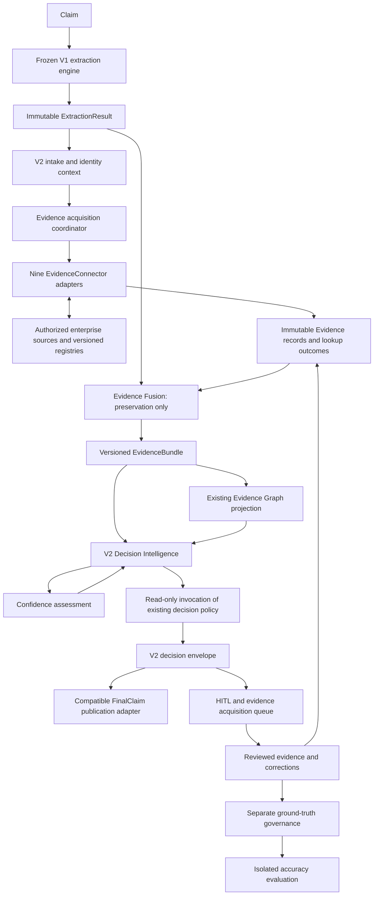
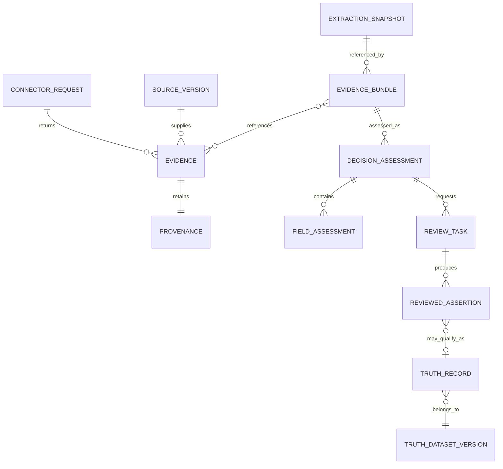
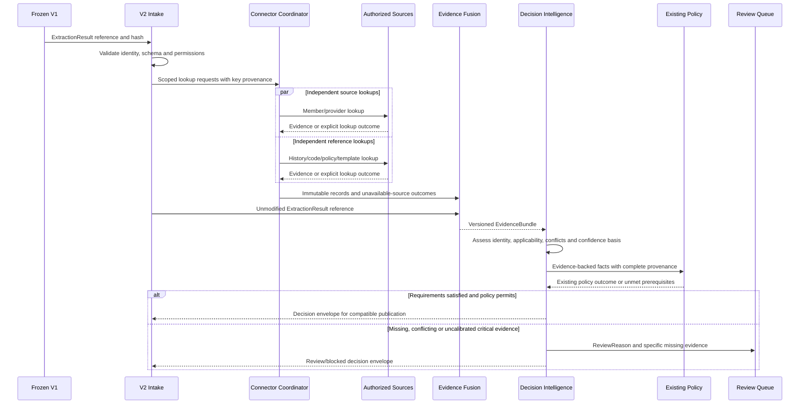

# CDP V2 — Enterprise Evidence Intelligence

Architecture and implementation planning proposal | 14 September 2026 | ashishdat/CDP

**Decision requested:** approve a staged, evidence-led investment around the frozen production extraction engine, beginning with source access and a bounded read-only connector pilot. This document does not authorize implementation, production activation or new adjudication policy.

## 1. Executive position

CDP V1 remains the production extraction engine. V2 begins at its immutable ExtractionResult boundary and adds independently sourced facts, preserved provenance, evidence assessment and controlled decision intelligence. Registration, Geometry, OCR, Candidate Ranking, Validators, Decision, Evidence, ExtractionResult, Telemetry and Operational Reporting remain unchanged.

In this document, **V1** means the existing engine identified by this request, regardless of historical V2/V3 names in repository packages. **V2** means the proposed enterprise evidence platform. It supersedes the earlier parallel-extraction redesign as the planning direction; it does not rename or replace deployed components.

The supplied baseline is 100 claims, 39% operational completion, 0% auto verification, no established independent evidence and unavailable ground truth. Stability of extraction components does not establish extraction accuracy or evidence completeness.

The business opportunity is to resolve facts that extraction alone cannot establish: identity, membership, applicable reference values, code validity, prior outcomes and policy applicability. More observations derived from the same TIFF cannot supply these facts independently.

Three constraints determine feasibility:

- A source can be authoritative for one fact and irrelevant to another. Provider identity does not prove a service occurred; code validity does not prove a diagnosis.
- Independent source origin does not ensure correct entity binding. A perfectly accurate registry response for the wrong member is harmful evidence.
- A downstream platform cannot automatically process a claim for which its required ExtractionResult does not exist. The 90% completion target requires an explicit upstream-artifact availability assessment, without changing V1.

No ROI, accuracy increase or production readiness is claimed from the proposed architecture alone.

## 2. Objectives and measurement contract

| Measure | Reported baseline | V2 objective | Definition and qualification |
|---|---:|---:|---|
| Operational completion | 39% | 90% | Existing final-claim completion definition, same input denominator and failure treatment. Keep separate from merely emitting an error/review envelope. |
| Auto verification | 0% | 50% | Provisional definition: independently verified eligible fields / all eligible fields on all submitted claims, including fields blocked by extraction. Record verified-claim rate separately. Product owner must ratify denominator before evaluation. |
| Manual review | 100% | Less than 30% | Claims requiring human intervention / all submitted claims. Report conditional rate among completed claims as well; reconcile the historical denominator before comparison. |
| Accuracy | Unavailable | Measure against independent outcomes | No assumed OCR improvement. Report field, critical-field and disposition accuracy on a frozen truth-backed holdout. |
| Safety | Unmeasured here | Agreed error budget | False auto-accepts, false rejects and unrecognized identity mismatches require explicit approval criteria. |

Field verification and claim review are different units. Verifying 50% of fields does not imply fewer than 30% of claims need review: one unresolved critical field can block an entire claim. If 50% is intended as a claim-level verification target, the remaining non-review dispositions must be explicitly explained. Targets must not be achieved by omitting blocked claims.

Let q be the fraction of submitted claims with usable ExtractionResults and r the fraction of those resolved by V2. With no alternative intake route, overall resolution is at most q × r. If only 39 of 100 have usable inputs, the ceiling is 39%, even with perfect enrichment. The observed 39 final outputs do not themselves prove that q equals 39%; establish q from saved artifacts before investment forecasts. If q is too low, record the 90% target as infeasible within this scope rather than relabeling failures or silently changing V1.

## 3. Component architecture

The existing V1 decision and output paths remain available. V2 first operates in shadow mode; its proposed decision envelope cannot replace a V1 output until compatibility and policy review permit promotion. Existing business rules are invoked through an adapter, not reimplemented. New reference-based acceptance permissions, if needed, are explicit V2 policy proposals rather than changes disguised as wiring.

Use existing storage, worker execution, reference-provider interfaces, graph facilities and trace references wherever their contracts fit. This design does not prescribe nine microservices, a new graph database, an LLM or a general agent framework. Connector isolation is a logical contract and source-access boundary.

Operational reporting and V1 telemetry remain frozen. V2 produces companion evidence-acquisition and assessment records linked to V1 execution IDs. These records never rewrite the original execution history.

## 4. EvidenceConnector contract

Every connector implements the same conceptual operation: **lookup a scoped request and return zero or more Evidence records plus an explicit lookup outcome**. This is an interface design, not code.

The request includes tenant, claim/document/field scope, source permissions, lookup keys and their provenance, applicable service date, requested assertions, source/version requirements, deadline and idempotency key. Connectors do not call one another or consume each other's conclusions. They may use ExtractionResult values as lookup keys, but must retain that dependency.

The minimum Evidence payload is the requested six attributes:

| Attribute | Meaning |
|---|---|
| source | Registry/system identifier and record authority |
| field | Scoped field or proposition, including document/page when relevant |
| value | Typed source assertion; not an overwrite of extracted text |
| confidence | Typed assessment with value or null, scale, method/version and reason |
| timestamp | Retrieval/observation time in UTC; distinct from fact validity |
| provenance | Source record ID, version, hash, lineage, query-key origin and derivation |

For enterprise use, the envelope also needs evidence ID, tenant/claim binding, source effective interval, recorded time, connector version, response/snapshot hash, evidence kind, authorization scope and explicit reason. Confidence must identify whether it measures identity matching, source assertion quality or a calibrated correctness probability; these are not interchangeable.

Lookup outcomes distinguish FOUND, NO_MATCH, AMBIGUOUS_IDENTITY, UNAVAILABLE, UNAUTHORIZED, STALE and ERROR. NO_MATCH is not evidence that an extracted value is false unless the source contract establishes complete coverage for that assertion. Errors and missing data carry null confidence, not an invented zero-probability fact.

An idempotency key binds tenant, request hash, source version and connector version. Identical snapshot requests can reuse an existing observation with its provenance. A later live-source response creates a new observation. Retries, if enabled in future production, apply only to bounded transient transport failures and never silently alter the pinned assessment; no claim replay is needed for enrichment.

## 5. Connector portfolio

| Connector | Source and supported assertions | Independence and limits | Activation prerequisite |
|---|---|---|---|
| Provider Registry | Authorized provider master/roster; identity, attributes and participation if present | Potentially independent of TIFF; may share NPI upstream data | Source owner, versioned records, identity binding and effective dates |
| Historical Claim | Independently finalized prior records and their amendments | Exclude CDP predictions, source echoes and unreviewed corrections; history does not prove current services | Original lineage, finalized-status semantics and stable claim linkage |
| Member Registry | Membership, demographics and enrollment source | External identity/coverage facts, contingent on correct member/payer/date | Authorized source and sufficient identity keys; no name-only guessing |
| NPI Registry | Versioned NPI source records | Establishes only source-supported provider facts; directory mirrors are not additional votes | Snapshot/version acquisition, identity mapping and freshness policy |
| Payer Rule | Approved payer/product policy with applicability dates | Normative evidence, not independent observation of the claim event | Policy owner, structured interpretation, release/effective-date control |
| ICD | Versioned code catalogs | Code existence/applicability, not clinical truth | Correct code system and applicable release |
| CPT | Authorized procedure-code reference | Code facts, not proof a procedure occurred; distinguish other code systems | Entitled source, release mapping and narrowly defined assertions |
| Template Registry | Authoritative template versions and asset metadata | Form-version facts, not validation of an extracted value | Version provenance and complete asset catalog; no runtime template changes |
| Master Data | Enterprise organizations, identifiers and controlled reference values | Independence assessed by domain and upstream origin; may mirror member/provider sources | Named data owner, authoritative domain boundaries and lineage |

Existing reference configuration currently marks five providers disabled and unauthorized. Interface availability is not source availability. Public NPI files and ICD releases exist, but usable CDP access, snapshots and mappings must still be established. See [CMS NPI distribution](https://download.cms.gov/nppes/NPI_Files.html) and [CMS ICD-10 releases](https://www.cms.gov/medicare/coding-billing/ICD-10-codes).

Master Data is not a catch-all truth oracle. Historical Claim and Member Registry may both inherit the same enrollment system. Preserve their common lineage. Source owners must state which assertions their records can support and where they are incomplete.

## 6. Domain model

**ExtractionSnapshot** references the unmodified ExtractionResult, hash, V1 version and execution identity. **SourceVersion** identifies an immutable snapshot or captured response and validity. **Provenance** records origin, dependencies and matching basis. **EvidenceBundle** is a versioned collection of those references plus lookup outcomes and missing-source information; it chooses no winner.

**DecisionAssessment** contains DecisionResult, ClaimConfidence, FieldConfidence, MissingEvidence, ConflictingEvidence and ReviewReason, together with policy, bundle and calibration versions. **FieldAssessment** retains extracted value, external assertions and any policy-selected value separately. **ReviewTask** names the unresolved question and evidence needed. **TruthRecord** is admitted only through independent source/adjudication criteria; a review action alone is insufficient.

Provenance can be mapped to the entity, activity and agent concepts in [W3C PROV](https://www.w3.org/TR/prov-overview/). This does not require replacing the existing Evidence Graph or adopting a particular serialization.

## 7. Sequence and failure behavior

If no usable ExtractionResult exists, intake records an upstream-unavailable V2 status linked to the V1 failure. It cannot synthesize an ExtractionResult or invoke registration/OCR. Missing lookup keys produce missing evidence. A source outage does not discard other records. At the configured deadline, an immutable partial bundle can be assessed; whether it supports a decision depends on policy, not on source count.

A new source record or reviewed correction creates a new bundle and assessment. Reassessment uses saved extraction and does not rerun V1. Publication must be idempotent and include revision lineage so a repeated delivery cannot issue duplicate downstream actions. Initial V2 publication is shadow-only with no external claim submission or production entity writes.

## 8. Fusion, independence and confidence

Fusion is preservation: validate envelopes, attach stable references and retain all observations and lookup outcomes. It does not vote, average, merge conflicting values, infer source authority, select winners or calculate correctness. Exact duplicate delivery can reference the same immutable evidence ID without erasing receipt provenance.

Decision Intelligence evaluates applicability and lineage from the bundle. The graph is its provenance view; it does not turn derived observations into independent truth. Two OCR providers, a validator of their result and an arithmetic check still share the image-derived input. Registry independence is assessed separately from the fact that its lookup key came from OCR. Query-origin bias and wrong-record matching remain material risks.

The Confidence Engine first returns explicit assessment categories: insufficient evidence, corroborated, conflicting, or independently verified within a defined assertion scope. Numeric 0-100 correctness confidence is nullable until supported by an applicable calibration dataset. Store evidence coverage and identity-match scores separately. Existing score fields that require a numeric probability cannot be populated with invented calibration; use a V2 companion envelope until a reviewed compatibility mapping exists.

Independent verification requires applicable source authority, established identity, relevant dates, non-circular lineage and satisfied policy requirements. It is not a fixed count of agreeing connectors. Critical conflicts remain visible even if another source supports the extraction. Authority precedence can resolve a conflict only where an approved, versioned domain policy defines precedence; otherwise request review.

ClaimConfidence must name its target, for example correctness of the claim disposition. It is not the average of field scores. Before claim-level calibration exists, publish the assessment state, unresolved critical fields and null numeric probability. Calibration and accuracy claims require independent outcomes and representative evaluation, not agreement statistics.

## 9. Decision, auto adjudication and ground truth

Decision Intelligence assembles evidence-backed inputs for frozen decision rules and exposes their prerequisites. It preserves original OCR, normalized values, external values and selected values as distinct records. A reference disagreement never silently edits V1 ExtractionResult.

Phase 2.4 auto adjudication is a controlled application of approved decision policy. Begin with narrow assertions and scopes where independent evidence is available. Shadow recommendations are not automatic payments, rejections or changes to the existing V1 decision engine. Activation requires a named business owner, error-budget acceptance and traceable rollback.

Ground truth is a separate governed product. Admit source-derived facts only for assertions the source authoritatively establishes; use independent adjudication for facts without such a source. Record label origin, valid dates, reviewer/authority, disagreement resolution and version. Do not promote auto-adjudicated outputs directly into truth, or evaluate V2 using labels copied from its own evidence sources without disclosing the shared source and limiting the conclusion.

Split evaluation by relevant entity/time/source relationships to limit leakage. Freeze the holdout and forbid its labels as runtime references. Track accuracy on the labeled scope and label coverage on the full scope. Missing labels remain unknown.

HITL is an evidence acquisition process: present the exact unresolved proposition, source excerpts and conflicting values, ask for supporting evidence, and preserve reviewer amendments. A reviewer merely agreeing with the proposed answer is weak independent evidence. Reusable corrections require origin review, not automatic promotion into historical truth.

## 10. Migration, build order and release gates

| Phase | Implementation scope | Exit gate |
|---|---|---|
| **2.1 Evidence Connectors** | Read-only adapters over existing reference contracts; source authorization, snapshots, identity and provenance | First sources return relevant, correctly linked records; missing/ambiguous/stale/unauthorized outcomes demonstrated |
| **2.2 Evidence Fusion** | Immutable bundles and graph projection using current facilities | All evidence and contradictions retained; same-source mirrors identified without voting; V1 artifacts unchanged |
| **2.3 Decision Intelligence** | Companion assessment envelope, confidence semantics, frozen-policy bridge | Reproducible decisions, explicit missing/conflicting evidence, unchanged public V1 behavior |
| **2.4 Auto Adjudication** | Shadow eligibility and bounded policy application | Independent review of false accepts/rejects; no production automation before phases 2.5-2.6 establish validation |
| **2.5 Ground Truth** | Source/adjudication governance, versioned truth records and held-out cohort | Label provenance, applicability and disagreement resolution approved; no circular evaluation |
| **2.6 Accuracy** | Frozen evaluation protocol; calibration and cohort error analysis | Approved error, coverage, latency and cost limits achieved with uncertainty reported |
| **2.7 HITL** | Structured review workflow, evidence requests, correction governance and rollout | Measured review effort, reviewer quality and safe release/rollback behavior |

Start truth governance and access work during 2.1; the numbered delivery sequence must not postpone the evaluation design until after automation. Use an existing manual review path until the 2.7 integration is accepted.

Recommended connector build order: NPI as a bounded technical pilot; Member and Provider registries as the first enterprise factual sources; Historical Claim and selected Master Data domains; ICD/CPT snapshots; Payer Rules; Template Registry. Access lead times run in parallel. NPI feasibility does not imply it has the highest business impact, and template evidence will not fix registration within this frozen scope.

Deliver one connector or integration boundary per PR. First prove one saved ExtractionResult plus one independent record and a complete bundle. Then prove a conflicting record and a missing record before scaling breadth. Promote by tenant, payer and claim type behind a separate V2 enablement boundary. Keep V1 APIs, artifacts and decision behavior available for rollback; disabling V2 stops future enrichment/publication without deleting evidence or reversing already issued actions silently.

## 11. Enterprise operations and controls

Use tenant-scoped source permissions, secret references and read-only credentials. Persist sensitive source payloads in access-controlled evidence storage rather than logs. Separate operational readers, source administrators, policy approvers and truth reviewers. Retention, deletion and legal-hold obligations must be reconciled with immutable audit requirements by the organization's owners; immutability is not permission to retain all claim data forever.

Pin source and policy versions for replay. Record both fact-effective time and system-recorded time. Protect artifact hashes and response provenance. Cache by tenant, query, source version and applicability; do not reuse another tenant's evidence or reinterpret a current record as a historical fact.

Set per-source deadlines, concurrency limits, rate limits, bounded transport retries and outage behavior. Circuit breaking may mark a source unavailable but cannot convert absence into agreement. Reprocessing evidence assessments must not re-execute V1. Use the existing infrastructure where suitable; establish service-level and recovery objectives with operations before production approval.

Measure connector availability, lookup coverage, identity ambiguity, temporal validity, independently supported fields, unresolved conflicts, source freshness, assessment latency, review minutes and cost per resolved claim in V2 companion reporting. Link every record to V1 telemetry without changing its format or reports.

Future tests cover contract compatibility, deterministic snapshot replay, provenance completeness, tenant isolation, source outage, ambiguous identity, stale data, shared-origin duplication, conflicts, evidence preservation, publication idempotency, truth leakage and rollback. No runtime tests or claims are executed by this design task.

## 12. Risk assessment

| Risk | Severity | Mitigation / decision gate |
|---|---|---|
| Completion target exceeds usable-input ceiling | High | Measure ExtractionResult availability first; preserve denominator and scope boundary |
| External sources unavailable or unauthorized | High | Fund access discovery first; contracts alone do not satisfy readiness |
| Wrong member/provider identity | Critical | Preserve key provenance, require approved identity binding and reject ambiguity |
| Circular history or mirrored registries | High | Record original source lineage; no vote counts or independence inferred from connector names |
| Reference truth confused with service truth | High | Assertion-specific authority and explicit unsupported facts |
| False confidence from uncalibrated scores | Critical | Typed confidence; numeric correctness probability remains null until validated |
| Policy drift hidden in integration | Critical | Frozen-policy adapter and separate approval for new V2 acceptance permissions |
| Truth leakage and self-labeling | High | Independent label governance, isolated holdout and source-overlap disclosure |
| Source version/date mismatch | High | Effective-date mapping and reproducible snapshots |
| Added latency, cost or outage coupling | Medium-high | Concurrent bounded lookups, measured budget and explicit partial-evidence behavior |
| PHI exposure or excessive retention | Critical | Tenant access boundaries, minimum necessary records and approved lifecycle policy |
| Review rate improved through automatic rejection | High | Report disposition mix, false rejects and review denominator alongside target |

## 13. Effort and staffing

Estimates are planning ranges in engineer-weeks, assuming existing components are reusable, one source per connector, accessible documentation and structured records. They include adapter tests and integration review; they exclude procurement delay, large manual-label campaigns, new OCR/registration capabilities and broad payer-policy authoring.

| Workstream | Engineer-weeks |
|---|---:|
| 2.1 Contracts, provenance and nine bounded connector adapters | 12-22 |
| 2.2 Evidence preservation and graph integration | 3-5 |
| 2.3 Decision envelope, confidence semantics and policy bridge | 4-7 |
| 2.4 Shadow auto adjudication and controls | 2-4 |
| 2.5 Truth governance tooling and dataset versioning | 3-5 |
| 2.6 Evaluation, calibration assessment and acceptance | 3-5 |
| 2.7 HITL integration and review controls | 3-5 |
| Cross-cutting security, operations and staged rollout | 4-6 |
| **Total** | **34-59** |

A bounded two-source pilot through shadow decision assessment is approximately 10-16 engineer-weeks, included in the full estimate. With four engineers, allow roughly 4-6 calendar months for the bounded full portfolio after access, with source owners, a claim-domain lead, security/operations and reviewers contributing separately. Parallelism cannot eliminate policy, access and validation gates. Re-estimate after source discovery and the first two connectors; unstructured payer content may exceed these ranges substantially.

## 14. ROI and funding gates

Rank by evidence applicability and recoverable business work, not by connector count:

| Priority | Investment | Potential value | Key uncertainty |
|---|---|---|---|
| 1 | Member/provider source access and identity binding | Independent facts for recurring critical identity fields | Source coverage and wrong-record risk |
| 2 | History/master data with verified origin | Reduced repeat review and reconciliation work | Staleness and circular data |
| 3 | Evidence bundles and policy bridge | Consistent decisions and auditable conflict handling | Whether current policy permits more automated outcomes |
| 4 | Truth-backed validation and HITL | Measurable error control and focused reviewer effort | Cost and representativeness of independent labels |
| 5 | Code/payer/template portfolio expansion | Targeted rule and applicability evidence | Incremental benefit beyond existing validators and source overlap |

Monthly net value = avoided review labor + contribution from additional correctly resolved claims + avoided rework - source fees - incremental compute/operations - expected error loss. Do not count saved review work again as avoided rework. Expected error loss requires validated error rates and business impact, not guessed confidence scores.

If N is monthly volume, p is measured reduction in review fraction, m is minutes saved per affected claim and h is loaded hourly review cost, gross labor savings are N × p × m × h / 60. Use observed values after the pilot. Payback equals implementation cost divided by positive monthly net value. No dollar forecast is defensible until volume, source cost, usable-input ceiling and review savings are known.

Fund sequentially: source-readiness discovery; bounded pilot; truth-backed decision validation; then portfolio rollout. Stop expansion where new connectors add no independently applicable evidence or cannot meet error/cost limits. Executive targets are hypotheses to validate, not delivery guarantees.

## 15. Open questions requiring owner decisions

| Question | Owner | Needed by |
|---|---|---|
| What fraction of the 100 claims has usable ExtractionResults, including incomplete final claims? | Engineering / Operations | Before forecasting 90% completion |
| What exact denominators define auto verification and manual review? | Product / Operations | Before evaluation protocol freeze |
| Which authorized member/provider/history sources exist, and who owns their authority and lineage? | Enterprise Data owners | Phase 2.1 |
| Which critical facts cannot be established by the proposed nine sources? | Claim domain lead | Pilot scope |
| Does existing policy permit independent references to resolve review requirements, or is separate V2 policy approval needed? | Business policy owner | Before phase 2.4 activation |
| Which auto-accept and false-reject limits are acceptable by field and disposition? | Business risk owner | Before validation gate |
| What identity-binding requirements apply when keys originate from OCR? | Data / Domain owners | Connector acceptance |
| Which source releases, retention rules and CPT entitlements are available? | Source owners / Security | Connector activation |
| What constitutes independently established truth, and who adjudicates disagreements? | Quality / Domain lead | Truth governance design |
| What latency, cost, availability and recovery budgets apply? | Operations / Finance | Production planning |
| Is FinalClaim an extraction artifact or authority to take a downstream claim action? | Product / Integration owner | Publication design |

## 16. Repository basis and scope record

Read-only design review used [reference contracts](packages/reference_enrichment/contracts.py), [reference configuration](config/reference_enrichment.yaml), [decision contracts](packages/evidence_decision/contracts.py) and the prior [Evidence Connector Roadmap](EvidenceConnectorRoadmap.md). Existing provenance and snapshot mechanisms are reuse candidates, subject to compatibility tests during implementation.

This is a documentation-only proposal. V1 remains frozen by design. No connector was enabled, no source credentials were exercised, no claims were rerun, no thresholds or algorithms changed, and no production-readiness certification is asserted.
