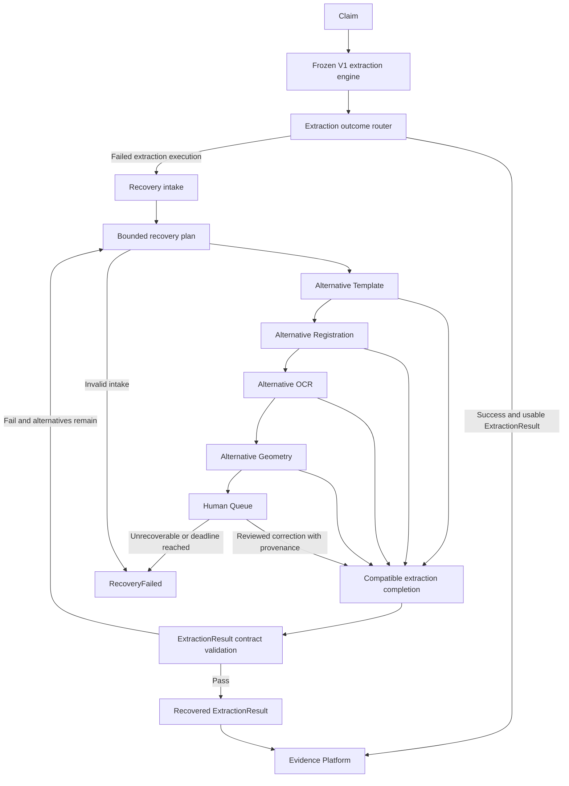
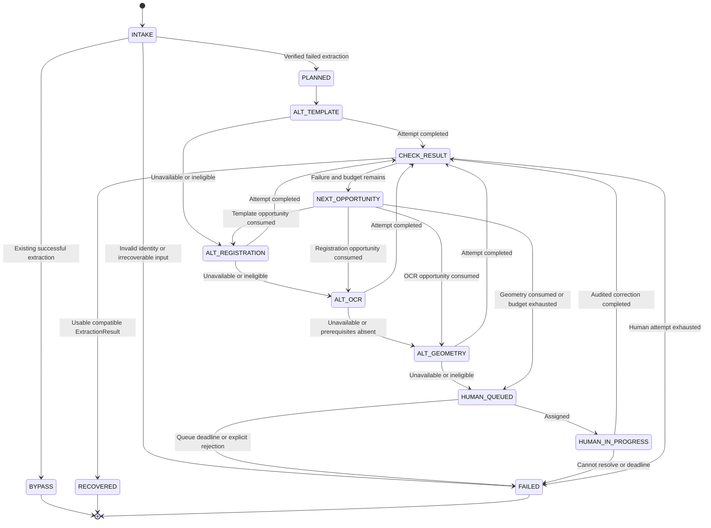

# CDP V2 Recovery Pipeline

Architecture, recovery strategy, state machine, cost, ROI and migration plan.

Design proposal — 14 September 2026 — ashishdat/CDP.

## Executive decision

Add a bounded Recovery Pipeline beside the frozen V1 extraction engine. It accepts failed extraction executions, uses explicitly configured alternative routes, and emits either a compatible recovered ExtractionResult or a terminal RecoveryFailed outcome. Successful extraction executions bypass recovery and enter the Evidence Platform directly.

Recovery addresses missing usable extraction artifacts. The Evidence Platform addresses independent corroboration and decision support. A recovered artifact is neither ground truth nor automatic approval.

This proposal does not change V1 algorithms, thresholds, safety rules, output schemas or telemetry. Alternative routes must exist and be qualified before activation; this design does not assume that an alternative registration or geometry implementation is available. No implementation, claim execution or retry was performed for this document.

## 1. Architecture and routing boundary

The diagram shows ordered escalation opportunities. It does not authorize executing an extraction dependency on an invalid upstream artifact. Each alternative is followed by completion of the necessary existing extraction steps and a contract check. A passing attempt terminates recovery immediately; later alternatives do not run.

The router reads an explicit extraction-stage outcome and verifies the ExtractionResult reference and integrity. It must distinguish extraction failure from downstream decision/evidence failure. A claim with a valid ExtractionResult but a failed final decision resumes downstream processing; it does not need extraction recovery. A review-required extraction result is not an extraction failure merely because fields need review.

If a recorded success references a missing or corrupt artifact, record a contract failure before admitting it to recovery. Never silently reinterpret a success as a failure. Claims still processing do not enter recovery. Tenant, claim, document, page and original execution identity remain stable throughout.

The Recovery Pipeline owns execution and budget. No alternative worker invokes another alternative. The existing extraction completion path retains ranking, validation and result assembly semantics; recovery does not implement copies of those rules.

## 2. Recovery strategy

Preserve the requested escalation order:

**Alternative Template → Alternative Registration → Alternative OCR → Alternative Geometry → Human Queue.**

This is a strategy order, not a substitute for the data-dependency order. Field OCR still requires valid field regions. If no trustworthy geometry exists at the OCR opportunity, record OCR as SKIPPED_PREREQUISITE and move to alternative geometry. A successful geometry alternative can then invoke existing OCR, ranking, validators and assembly as its completion steps. That is a new attempt with a new geometry input, not a return to the OCR escalation state.

| Opportunity | Eligibility and permitted change | Must preserve | When it cannot run |
|---|---|---|---|
| Alternative Template | Another existing, compatible template/reference version is available and meets current selection requirements | Original source, template provenance, qualification thresholds and safety checks | No qualified alternative, missing reference or incompatible document family |
| Alternative Registration | An existing approved alternate route or valid reference configuration can handle the selected source/template pair | Safety gates, coordinate semantics and frozen acceptance criteria | No approved alternative; missing assets; route cannot satisfy prerequisites |
| Alternative OCR | Existing alternate provider is available and valid canonical crops already exist | Crop bounds, provider policy, ranking and validation rules | Missing geometry; same provider/input/configuration was already attempted; source authorization absent |
| Alternative Geometry | An existing approved alternate region strategy applies to a successful registration | Source/template/transform lineage and geometric validity; no crop outside accepted regions | Registration failed; no compatible alternative strategy |
| Human Queue | Automated opportunities are exhausted or cannot safely proceed | Original evidence, explicit edits, reviewer identity and unchanged safety criteria | Invalid/unreadable input may require resubmission or terminal failure |

A different template does not automatically qualify. A different registration route does not bypass safety. Human review may correct a documented page/template association, provide missing assets through an approved process, request a readable source, or produce audited field data if the established artifact contract permits it. It may not declare a failed transform safe or invent OCR/geometry evidence.

If manually entered values cannot be represented honestly by the existing ExtractionResult contract, return a linked manual-resolution artifact or RecoveryFailed for this extraction workflow. Do not fake an ExtractionResult to improve completion metrics.

Failure-directed eligibility avoids unnecessary work while retaining the ordering. An OCR provider outage normally skips template and registration alternatives when their outputs remain valid. A registration failure cannot be repaired by running geometry or OCR against untrusted coordinates. Unsupported forms with no qualified routes go to the human queue without speculative attempts.

## 3. State machine

**Invariants:** one active attempt per recovery execution; monotonic strategy index; finite attempt budget; immutable attempt records; successful results are terminal; every skipped opportunity has a reason. CHECK_RESULT remembers the originating opportunity. Human completion cannot route back into the automated sequence or create an unbounded loop.

Queue admission is pending work, not RecoveryFailed and not recovery success. A queue deadline or explicit unresolvable outcome establishes failure. If the human workflow is asynchronous, callers receive the recovery ID and pending status; the eventual terminal outcome remains RecoveredExtractionResult or RecoveryFailed.

A corrected source uploaded after terminal failure is a new execution with parent lineage, never a silent retry of the closed one.

## 4. Execution contracts and artifact lineage

A RecoveryRequest contains original execution ID, failure stage/reason, tenant/claim/document identity, immutable source references/hashes, existing artifact references, route/configuration versions and the permitted cost/time budget.

A RecoveryPlan records eligible alternatives in order, why other opportunities are unavailable, the artifact prerequisites for each route and the maximum number of attempts. A first pilot should permit at most one approved route per automated opportunity, plus one human resolution attempt. Thus the automated ceiling is four route attempts, not a template × registration × OCR × geometry search. Any future expansion requires explicit budget and review.

A RecoveryAttempt records attempt ID, parent execution, strategy, route/version, exact input hashes, reused artifacts, start/end, cost, status, failure gate and generated artifact references. An idempotency key binds original execution, strategy, route/configuration and input hashes. Identical attempts are not rerun. Two consumers receiving the same job must not trigger duplicate provider calls; use the existing execution/store concurrency facilities where they meet this requirement.

Artifact compatibility is strict:

- Template change invalidates registration and template-dependent geometry, crops and field mapping.
- Transform change invalidates geometry and crops derived from the old transform.
- Geometry change invalidates cropped OCR and downstream selections for affected fields.
- OCR-provider change can reuse verified geometry, but requires downstream ranking/validation/assembly for the new observations.
- Unaffected artifacts may be reused only with complete identity, version and hash compatibility.

The completion path emits the existing ExtractionResult schema. A separate RecoveryResult envelope links it to the failed execution and attempt chain. It distinguishes automated versus human-assisted recovery and preserves original failures. V1 telemetry and operational reports are not edited; companion recovery records reference them.

Output publication is idempotent: the same terminal recovery result enters the Evidence Platform once logically, even with duplicate transport delivery. New revisions remain explicit. Never overwrite a V1 ExtractionResult or count the same claim twice in completion metrics.

## 5. What counts as recovered

Recovery succeeds only when the existing artifact contract is met: correct claim/document binding, required structural fields, consistent source/registration/geometry references where required, valid field-result lineage and usable serialization. Existing validator outcomes remain visible. A completed extraction can still contain INVALID, SUSPICIOUS or NO_VALUE fields where the established contract allows them; report those counts rather than equating artifact existence with accuracy.

A template match, a successful transform or nonempty OCR is an intermediate result, not successful recovery. No new acceptance threshold is introduced by this architecture. A structurally compliant but low-quality result can require downstream review.

RecoveryFailed includes original failure, opportunities attempted/skipped, the final deterministic blocker, exhausted budget, artifact references and recommended human/resubmission action. It never erases the original error.

## 6. Cost model and controls

Charge only failed extraction executions to recovery. Successful claims incur the routing/contract-check cost but no alternative engine calls.

For eligible failures, let a_i be the fraction reaching and invoking opportunity i, and c_i its mean incremental cost including required completion work. Expected automated cost per failed claim is the sum of a_i × c_i. Add human queue probability × handling cost, storage and orchestration overhead. Each c_i includes downstream recomputation; an alternative-template attempt is not priced as just a template lookup.

For a particular claim, total recovery wall time is the sum of attempted route times, completion checks and queue delay. Report automated compute latency separately from human elapsed time. Bound per-claim dollars, wall time, provider calls, route attempts and human handling; numerical production limits need measured provider costs and an operations owner.

| Cost driver | Control |
|---|---|
| Template/registration alternatives | One qualified option per opportunity in the initial pilot; no combinatorial search |
| OCR | Deduplicate identical calls; invoke only against valid artifacts; account for completion dependencies |
| Geometry/completion | Reuse only compatible artifacts, count required new OCR/ranking/validation work |
| Human queue | Explicit question, source evidence, handling budget and closure deadline |
| Storage | Store references to unchanged originals; retain versioned attempt artifacts under approved retention |
| Duplicate execution | Idempotent intake, attempt ownership and result publication |

Transport failures and algorithmic failures must be distinguished. Initial qualification should use no automatic retries. A future transport-retry policy, if authorized, must remain inside the same declared attempt budget and preserve exact input versions.

## 7. ROI and target feasibility

Let f be the fraction of all submitted claims eligible for extraction recovery, r the fraction of those that gain a usable artifact, and d the fraction of recovered artifacts that subsequently achieve the existing final-claim completion definition. Incremental completion is f × r × d. This is not the same as the artifact recovery rate r.

As an illustrative upper-bound calculation only: if all 61 incomplete claims in the 100-claim baseline were eligible extraction failures, moving from 39 to 90 final completions would require 51 additional completions, or 51/61 = **83.6%** end-to-end conversion of those failures. At 80% recovery and perfect downstream completion, the result would be 87.8%, below 90%. If some failures are downstream, attribute their recovery to the Evidence Platform separately and avoid double counting.

Monthly net benefit equals contribution from additional correctly completed claims plus avoided existing manual work and rework, minus automated recovery cost, added human work, operating cost and expected error loss. Human-assisted recovery is not automatically a reduction in manual review. Measure review minutes and the fraction of all claims touching humans, including the recovery queue.

Prioritize routes by observed **incremental correctly completed claims per total cost**, with engineering risk and error limits as gates. No numeric route ROI ranking is justified before a fixed failed cohort is evaluated. Initial hypotheses are:

| Opportunity | Potential benefit | Main risk |
|---|---|---|
| Alternative template | Recovers incorrect/unsupported current template choice when a compatible qualified version exists | Wrong-template acceptance and full downstream cost |
| Alternative registration | Recovers route-specific failure | No alternative may exist; safety cannot be relaxed |
| Alternative OCR | Recovers provider availability or recognition gaps with valid regions | Correlated OCR errors and extra provider cost |
| Alternative geometry | Recovers region-localization failure after valid registration | New crops invalidate existing OCR and can misassign fields |
| Human queue | Resolves source/page ambiguity or requests corrected inputs | Handling cost, delay and mistaken completion claims |

Recovery creates more extraction evidence, not independent corroboration. Repeated OCR agreement does not increase source independence. Evidence Platform verification and truth-backed accuracy remain separate gates.

## 8. Migration plan

| Phase | Deliverable | Exit condition |
|---|---|---|
| R0: Failure inventory | Saved-artifact audit of extraction failures, downstream failures and contract failures | Eligible denominator established; successful claims excluded; no replay needed |
| R1: Route readiness | Catalog existing alternatives, prerequisites, versions and costs | Each enabled route demonstrably exists and retains frozen safety/acceptance semantics; absent routes marked unavailable |
| R2: Routing and contracts | Recovery intake, plan and companion outcome design implemented around V1 | Successful claims bypass; missing/corrupt artifacts are explicit failures; V1 output unchanged |
| R3: Bounded recovery | One alternative per opportunity, artifact invalidation and idempotency | No identical retries, invalid crops or unsafe continuation; finite execution demonstrated |
| R4: Human handoff | Pending/terminal lifecycle, provenance and resubmission contract | Human outcomes cannot masquerade as engine evidence; queue closure is reliable |
| R5: Controlled qualification | Fixed failed cohort, one approved bounded recovery execution per claim | Measure route yield, correctness where labeled, incremental cost, latency and downstream completion |
| R6: Evidence handoff | Idempotent recovered-artifact publication to V2 | No duplicate claim counts; recovered results are distinguishable and traceable |
| R7: Limited rollout | Per-tenant/form enablement and rollback | Approved error, budget and review limits; V1 remains untouched |

Use one integration boundary per PR. Missing alternatives require a separate engineering proposal; do not invent new algorithms as part of wiring recovery. Disable recovery to roll back: new failed claims follow the existing failure handling, successful claims continue to Evidence Platform, and completed recovery artifacts remain auditable. Closing in-flight work follows an explicit drain/cancel policy.

Future tests must demonstrate successful-claim bypass, failure-stage routing, downstream-only failure exclusion, invalid prerequisite skipping, stale-artifact rejection, frozen safety behavior, attempt-budget exhaustion, duplicate delivery, human queue expiry, compatible ExtractionResult generation and single logical evidence publication. This document runs none of those tests.

## 9. Decisions before implementation

Confirm the usable ExtractionResult failure count; catalog available alternative routes; define the artifact contract's treatment of human-entered values; choose the pilot claim scope; set per-claim compute/provider/human budgets and queue deadline; assign the route-acceptance owner; establish accuracy/error acceptance criteria; and confirm the existing execution/store facilities support attempt ownership and idempotency.

The recommended first build is failure routing plus one proven alternative route, complete artifact lineage and a safe human-queue fallback. Expand only when measured incremental yield supports the next route. Do not fund a four-way search engine before confirming that the alternatives exist.

This document complements [CDP V2 Enterprise Evidence Architecture](CDP_V2_Enterprise_Evidence_Architecture.md). It is documentation only: no V1 changes, no recovery execution, no threshold changes and no operational completion claim.
