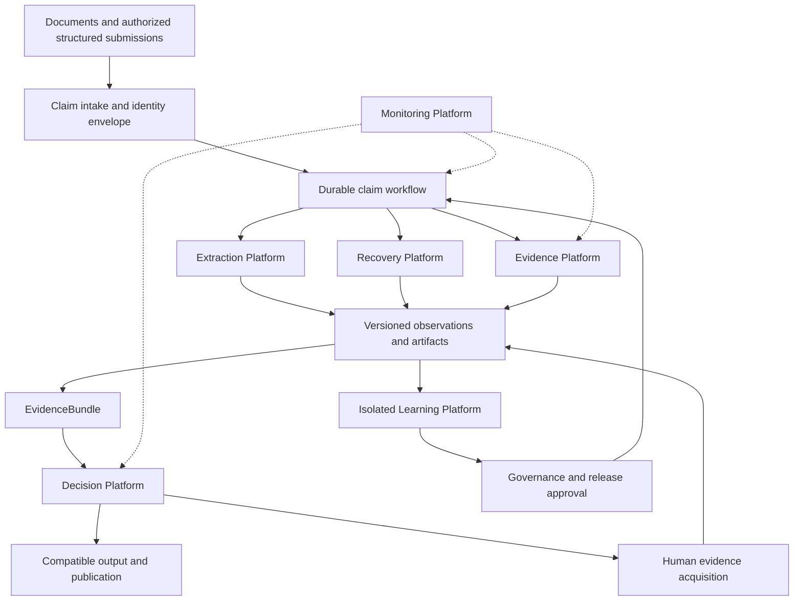
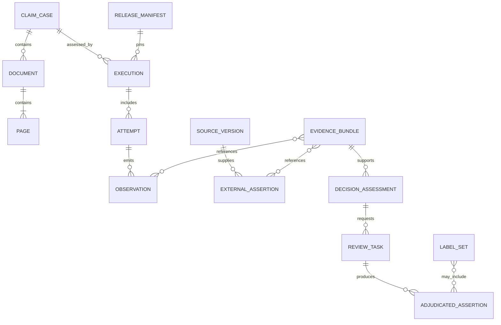
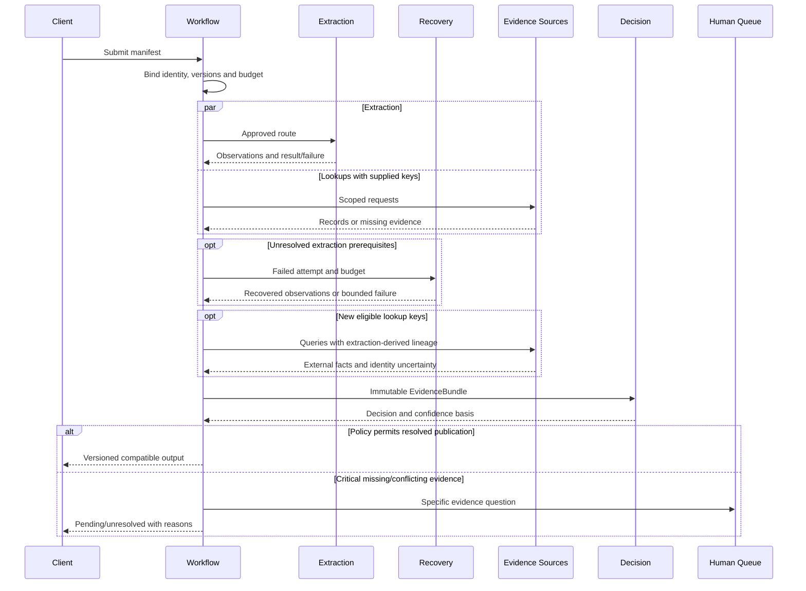
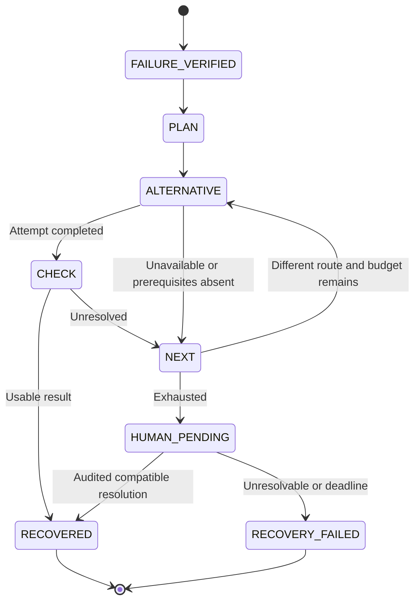
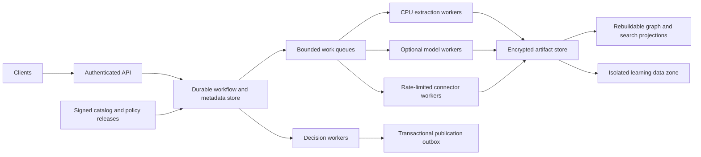

# CDP V2 — Enterprise Claim Intelligence

CTO and Architecture Review Board proposal | 14 September 2026 | ashishdat/CDP

Planning horizon: three years. Status: proposed architecture, not implementation approval or production certification.

## 1. Executive recommendation

Build a claim-centered platform that preserves document and field hypotheses, acquires authoritative external facts, performs bounded recovery, and issues reproducible policy decisions. Extraction becomes a capability rather than the universal gate determining whether a claim can be understood. Establish governed truth and evaluation alongside the first product capabilities.

This greenfield target supersedes the earlier constraint that V2 must retain V1 architecture. Actual V1 code remains untouched. Reuse individual implementations only where contract tests, quality, isolation and economics justify it. Keep client compatibility and uninterrupted service during migration; do not preserve accidental internal coupling.

Fund a bounded first 90 days, then rebaseline against source access and route yield. The three-year roadmap is a sequence of investment gates, not a commitment to three years of development before useful delivery.

### Assumptions challenged

1. A claim is not a page. Preserve claim/document/attachment/page relationships; classification remains a hypothesis until sufficient evidence exists.
2. Registration is route-specific. Template-aligned extraction requires safe registration. Structured submissions and qualified template-independent routes require their own controls, not a fabricated transform.
3. Extraction is not truth. Identity, code validity and evidence that a service occurred are different assertions.
4. A graph is not independent evidence. Treat it as a rebuildable provenance projection, not a truth oracle or mandatory transactional database.
5. Repeated OCR agreement does not establish confidence in correctness. Confidence needs explicit meaning, lineage and applicable validation.
6. Recovery is constrained search. It must have finite routes, prerequisites and budgets, not unlimited retries.
7. Silver labels scale training but do not certify the system that generated them.
8. Conflict-only review misses shared errors. A small independent audit of apparently agreeing cases is needed unless authoritative independent outcomes already cover them.
9. A pending review envelope or automatic rejection must not inflate completion or automation metrics.

## 2. Current architecture review

V1 provides classification, template selection, registration, geometry, OCR, ranking, validation, decision, evidence, artifacts and telemetry. Its observed route gates downstream extraction on selection and registration. This is a useful document route but a restrictive universal enterprise architecture.

| Area | Strength | Weakness / technical debt | V2 decision and ROI rationale |
|---|---|---|---|
| Extraction capabilities | Existing adapters, tests and field artifacts | Route dependencies can block all downstream work | Reuse isolated capabilities when qualified; avoid recreating working algorithms |
| Registration/geometry | Explicit safety gates | Template/transform dependency narrows supported inputs | Retain for aligned routes; validate alternatives independently |
| Claim interpretation | Classification and bundle work exist | Correct claim/page selection lacks independent truth | Make composition and page lineage first-class |
| Ranking/validation | Deterministic consistency logic | Derived checks are not independent corroboration | Reuse with explicit input dependencies |
| Artifact handoffs | Saved artifacts permit replay | Historical missing-evidence handoff required repair | Versioned contracts and compatibility tests |
| Evidence graph | Can expose lineage/conflicts | Independent sources absent | Immutable records as authority; graph as projection |
| Decision | Existing policy and review behavior | Completed cohort still requires field review | Separate evidence assessment from policy permission |
| Reference sources | Interfaces and snapshot support exist | Configured providers disabled/unauthorized | Source-readiness gate before connector investment |
| Telemetry | Per-run evidence supports attribution | Historical evidence completeness/denominators vary | Capture execution events with common lineage IDs |
| Release practice | Subsystem commits and tests exist | Workspace includes uncommitted implementation and generated artifacts | Reproducible releases and separate artifact storage |

These are architectural assessments, not a full code audit. Current worktree state is not asserted to have caused the measured failures. Safety rejection is not itself an algorithm defect. Sunk cost alone does not justify reuse.

## 3. Root cause analysis grounded in one aligned run

Use `runs/anchor-normalization-100-01`, measured commit `c6dbdea545da5a177a219a588ecbae3a67c54c41`. The [delta report](AnchorNormalizationDeltaReport.json) records 100 claims, 284 pages, verified source hashes, identical invocation, concurrency one and no retries. Sample SHA256: `07369b58a4f33229e8e2a0d1648b9ed64fa99d38d781b37d20ffce7fadae5e72`.

| Observed outcome | Claims | Established conclusion |
|---|---:|---|
| Final-claim completion | 39 | Existing route completed; all 39 required review |
| Selection unavailable | 27 | No candidate qualified under recorded rules |
| Selected registration safety failure | 34 | Selected candidate did not pass registration safety |
| Total | 100 | Mutually exclusive outcomes account for this cohort |

Within the 27 selection failures, [saved evidence](SelectionRootCauseReport.json) records 23 with all CMS1500 anchor scores below threshold and four with a passing anchor score but a required anchor missing. All 27 had layout scores below threshold. UB04 reference unavailability blocked that alternative; it does not prove the claims were UB04. Candidate-level reasons overlap and must not be summed as exclusive claim causes.

The rejected cohort contains 181 pages, including 171 classified Unknown. This establishes classifier uncertainty, not actual document type. [Anchor coverage](AnchorCoverageReport.json) shows required anchors commonly detected in successful registrations; it does not establish global template obsolescence.

The preceding aligned run completed 38 claims. Normalization raised completion to 39, reduced selection-unavailable from 29 to 27, and increased safety failures from 33 to 34. Improving one gate exposed the next gate; this is not evidence of registration regression.

**Supported diagnosis:** the route concentrates availability risk at qualification and safe registration. Missing independent sources and unavailable truth separately limit verification and accuracy certification; they do not explain the upstream 61 failures.

**Not established:** all 61 are valid supported forms; thresholds are wrong; a single matcher defect explains them; or connectors alone can recover them. Do not combine historical runs' inlier/rotation values to invent a common physical cause.

Aligned latency: mean **48.506 s**, median **8.422 s**, P95 **118.617 s**, P99 **166.773 s**, across all attempts. Fast failures can lower averages. Report successful/failed/recovered cohorts separately. The stated 100% manual review means all completed claims required review; the report itself records 39 review-required and 61 incomplete out of 100 submitted.

## 4. Greenfield target architecture

A versioned ClaimCase contains submission facts, document/page relationships, observations, external assertions, unresolved questions and decision revisions. A durable workflow dispatches approved capabilities under deterministic route policy and budgets. It cannot invent routes or acceptance policies online.

Structured facts may enter before extraction with provenance and authorization. TIFF-only claims still need reliable document interpretation and identity binding. Partial observations can support explicitly uncertain lookups even if no complete ExtractionResult exists; they cannot be represented as a successful extraction.

ExtractionResult remains a supported compatibility artifact. New routes do not pretend they performed template registration. Client-visible semantic changes require versioned contracts. Existing APIs need an adapter, not an implicit rewrite.

## 5. Platform decomposition

| Platform | Owns | Boundary / primary contract |
|---|---|---|
| Extraction | Composition hypotheses, localization, text/field observations, ranking/validation capabilities | ExtractionAttempt → artifacts/status; no enterprise truth |
| Recovery | Alternative planning, prerequisites, attempts, budgets and escalation | RecoveryPlan → recovered/unresolved; no relaxed safety |
| Evidence | Authorized lookup, provenance, source assertions and preservation | EvidenceRequest → individual records/outcomes; no voting |
| Decision | Fact assessment, approved policy, confidence basis and explanation | EvidenceBundle → DecisionAssessment; no source alteration |
| Learning | Silver labels, experiments, calibration and evaluation | Candidate release; no production writes or self-deployment |
| Governance | Source authority, policy/model approvals, access and release control | Approved immutable manifests |
| Monitoring | SLOs, business funnels, drift, cost and auditability | Recorded events → metrics/alerts; no reconstructed history |

These are domain boundaries, not seven mandatory microservices. Start with API/workflow, scalable extraction workers, connector workers and isolated learning. Split deployments when ownership, scale or fault isolation warrants it.

## 6. Interfaces and domain model

All requests carry tenant/claim/execution identity, idempotency key, input hashes, deadline and pinned versions. Responses distinguish success, partial, unavailable and failure with reasons and artifact references. Publication commands are separate from read-only assessments.

| Interface | Input | Output / invariant |
|---|---|---|
| SubmitClaim | Source manifest and submission identifiers | ClaimCase; file hash alone is not business duplicate identity |
| ExecuteCapability | Approved route, scoped inputs, budget | Immutable attempt; no hidden sibling calls |
| RequestRecovery | Failure/partial result and prerequisites | Finite plan and attempt chain |
| LookupEvidence | Assertion, keys/origin, source/date permissions | Records plus explicit missing/ambiguous/outage outcomes |
| PreserveEvidence | Observations and references | Bundle without winner selection or averaging |
| AssessDecision | Bundle, policy and calibration versions | Decision, confidence, review reason, business explanation |
| PublishDecision | Approved revision and destination | One logical publication despite duplicate delivery |
| RecordAdjudication | Question, evidence, authority and correction | New assertion; no overwrite of observations |
| PromoteRelease | Candidate and validation approvals | Immutable release; no self-promotion |

Evidence retains source, scoped proposition, typed value, confidence meaning, observation/effective times, source record/version/hash, authorization, identity basis, query origin and derivation parents. Raw observations, normalized values, external assertions, conclusions and labels remain distinct. Absence is not contradiction without an authoritative completeness contract. Graph supports/contradicts/derived-from relations are rebuildable from retained records.

## 7. Sequence

Pending review is not resolved completion. New evidence creates a decision revision. Irreversible downstream actions require explicit amendment workflows, not merely database rollback.

## 8. Recovery architecture

Baseline escalation: **Alternative Template → Alternative Registration → Alternative OCR → Alternative Geometry → Human Queue**. Skip ineligible steps with reasons. Do not run field OCR without valid regions to satisfy list order.

A monotonic route index and finite attempt count bound the loop. Propose initially one alternative per automated category, no identical route/input/version repeat, and a separately bounded human task. Transport retries consume the same budget and apply only to transient failures. These are planning controls, not optimized limits.

Template changes invalidate registration and dependent geometry/crops; transform changes invalidate dependent geometry/OCR; geometry changes require new OCR for affected crops; OCR changes require ranking/validation. Preserve reused/recomputed lineage.

If geometry is absent, skip alternative OCR; an alternative-geometry attempt includes its required OCR completion. Template-independent routes require separately validated localization and quality contracts. They cannot relabel failed registration as success.

A valid extraction with downstream decision failure resumes downstream. Successful extractions bypass recovery. Human queue admission is pending. Manual values cannot carry fabricated OCR/transform evidence. Each alternative must exist and be qualified before activation; absent capabilities require separate engineering approval.

## 9. Evidence architecture

| Connector | Supported assertions | Limits |
|---|---|---|
| Historical Claims | Independently finalized prior facts/amendments | Exclude CDP copies and source echoes; not current service truth |
| Provider Registry | Identity, attributes and participation if authoritative | May mirror NPI; correct binding/date required |
| Member Registry | Demographics, enrollment and coverage | Wrong-person lookup risk |
| NPI | Source-supported identifiers/attributes | Does not by itself establish service occurrence or payer participation |
| ICD | Versioned code validity | Not diagnosis truth |
| CPT | Authorized procedure-code facts | Not proof a procedure occurred; entitlement/release required |
| Payer Rules | Approved policy applicability | Normative evidence, not observation |
| Template History | Authoritative versions/layout metadata | Route applicability, not field correctness |
| Master Data | Owned enterprise facts | May replicate other sources |

Connectors run independently but retain common origins. Independence is assertion-specific, not a connector count. Registry lookup with OCR keys has external source origin and dependent query selection; preserve both. OCR, its validator and a history copy are not three corroborators.

Source contracts declare authority, completeness, dates, identity requirements, access and failures. Unauthorized, unavailable, stale, ambiguous and no-match are distinct. Current disabled sources require readiness work before forecasts assume useful records.

## 10. Fusion and decision intelligence

Fusion preserves records and lineage without voting or averaging. Deterministic fact assessment applies explicit identity, temporal and authority rules; unresolved conflicts stay visible. Each conclusion references the records and rule versions that produced it.

Decision returns disposition, selected facts/alternatives, field confidence, claim confidence, missing/conflicting evidence, review reason and a templated business explanation naming the applicable rule and supporting source. No LLM invents facts, rules or post-hoc explanations.

Confidence distinguishes source quality, identity matching, calibrated field correctness and calibrated disposition correctness. Every numeric score includes method/version and provenance; correctness probabilities additionally require calibration cohort and applicability. Unknown is null. Do not average field scores into claim confidence.

Start with transparent evidence sufficiency and approved policy. A future calibrated model can be deterministic at inference for pinned versions, but remains distinct from preservation-only fusion and requires independent evaluation. Source-based acceptance changes require business-owner approval. Correct extraction and correct claim disposition are different outcomes.

## 11. Scalable truth and learning

| Data product | How produced | Use |
|---|---|---|
| Source-attested truth | Correct entity/date, independent authority and assertion scope | Evaluation in that scope; disclose shared runtime source |
| Silver labels | Versioned labeling functions, rules, matches and weak supervision with abstention/dependency handling | Training/prioritization, not certification |
| Adjudicated truth | Independent conflict resolution and targeted audits | Governed evaluation/correction reuse |

Weak supervision can model noisy labeling functions and their dependencies; it produces training labels, not universal correctness certification. See the [Snorkel research paper](https://arxiv.org/abs/1711.10160). Offline label modeling does not change deterministic runtime evidence preservation.

Avoid indiscriminate mass labeling. Start with authoritative facts and focus adjudication on conflicts, critical gaps and new routes. However, **conflict-only human review cannot establish unbiased >98% accuracy where sources share errors**. Recommend a small independent audit of non-conflicting automatic outcomes. If forbidden, restrict accuracy claims to independently established facts and leave the rest uncertified.

For intuition: with zero errors in n independent Bernoulli observations, the one-sided 95% upper error bound is 1 − 0.05^(1/n); n=149 places it below 2%. This is an idealized planning bound, not a dataset prescription. Claim clustering, field classes, nonzero errors and coverage require more evidence; many fields from a few claims are not independent samples.

Learning flow: pinned data → silver labels with lineage → entity/time-aware split → candidate training → untouched independent evaluation → calibration/slice/cost review → shadow/canary → approved release. Holdout labels never become runtime lookup sources. Production outputs never become truth automatically.

Corrections are governed assertions, not immediate training updates. No online self-modification, autonomous threshold changes or self-promotion. Drift triggers investigation or an offline candidate, not a hidden production change. Keep previous approved releases and datasets for replay and rollback.

## 12. Deployment and scalability

Use managed durable queues, transactional metadata and object storage where suitable. Start single-region, multi-zone, with tested backup/restore and a recovery plan. Defer active multi-region execution until residency, scale and recovery objectives justify its consistency and operational costs. A dedicated graph database is optional.

Metadata transactions own workflow state and publication intent; large artifacts live in object storage. At-least-once delivery plus idempotent attempts/publication yields one logical result without claiming exactly-once network delivery. An outbox and reconciliation handle interrupted publication. Caches are scoped by tenant, source version, query and effective date.

Partition by tenant/claim, cap noisy tenants and connector concurrency, and scale CPU/GPU pools separately. Autoscale on queue age and work demand, not CPU alone. Bound speculative execution; do not call every provider for every field. Batch only where latency budgets permit.

For arrival rate lambda, average worker service time s and target utilization u, an initial concurrency estimate is lambda × s / u, refined with measured distributions and queue simulation. Illustratively, 10 claims/second at 8 worker-seconds and 70% utilization needs about 115 concurrent slots before recovery/redundancy. These are hypothetical sizing inputs, not CDP measurements. Source quotas may dominate capacity.

## 13. KPI and monitoring contract

| Metric | Baseline / target | Definition |
|---|---|---|
| Extraction availability | Baseline must be separated from final completion | Usable full-scope extraction artifacts / all accepted claims; selected-page coverage separately |
| Recovery success | Measure by eligible failure cohort | Failed extraction claims gaining usable artifacts / eligible failed claims; automatic/human separate |
| Operational completion | 39% → 90%+ | Substantive final outcomes / all accepted claims; pending/blocked/timeouts visible |
| Automatic verification | 0% → 60%+ | Provisional: independently verified eligible fields / all eligible fields, including missing ones; all-critical-fields claim rate separate |
| Manual review | All completed baseline claims → <20% | Claims touched by humans / all accepted claims, including recovery; also minutes per claim |
| Critical field accuracy | Unknown → >98% | Independently correct critical fields / labeled critical fields, with interval and label coverage |
| Mean processing time | 48.506 s → <20 s | Machine-path elapsed time including queue/recovery; human elapsed time separate |
| P95 processing time | 118.617 s → <60 s | Same population and start/stop definition as mean |
| Decision quality | Unmeasured here | False acceptance/rejection and disposition accuracy on independent outcomes |
| Cost | Establish baseline | Per submitted, completed and correctly resolved claim, including human/source costs |
| Evidence coverage | Independent evidence absent | Applicable independent facts / required facts; stale/ambiguous/missing separate |

The automatic-verification denominator needs product approval. If 60% refers to claims rather than fields, define remaining automatic dispositions explicitly. A 60% field rate does not imply <20% claim review: one missing critical field may block every claim. Do not exclude incomplete claims from automation targets.

Recommend machine-path latency targets, including queueing and bounded recovery, with separate human time-to-resolution. If the stated targets include human queue time, feasibility depends on immediate staffing and is unproven. A fast pending response cannot count as completion.

A fast-path planning allocation is 2 seconds intake/queue, 8 extraction, up to 5 additional source-wait seconds after overlap, 2 decision/publication and 3 reserve. This is a budget hypothesis, not a benchmark. Recovery fits the remaining deadline or becomes explicit asynchronous unresolved work. P95 cannot be obtained by adding stage P95s; measure complete distributions under load.

Monitoring links claim → execution → attempt → source → bundle → decision → release. Capture during execution. Alert on queue age, source outage, contract failures, cost overruns, route-mix changes, confidence drift, conflicts and sampled accuracy degradation. Slice by provider/model/source version, form, payer, tenant and outcome.

Report technical availability separately from business resolution. Preserve aligned cohort/version denominators. The 100-claim sample is not a production-wide estimate without representativeness analysis.

## 14. Governance, security and compliance

Assign source owners for authority/lineage, a domain owner for policy, engineering for routes, quality for truth, security for access, operations for SLOs, and a release approver. Separate authoring and production approval privileges.

Maintain a risk register covering context, measurement and ongoing management, consistent with the voluntary [NIST AI RMF](https://www.nist.gov/itl/ai-risk-management-framework). This is a governance reference, not regulatory certification.

Tenant authorization covers requests, caches, artifacts, projections and learning exports. Encrypt transport/storage, isolate credentials, minimize PHI in logs, audit access and restrict egress. Treat documents and source payloads as untrusted: isolate parsers and bound input/resource sizes. Retrieved text is never executable instruction.

Responsible organizational owners must approve source licenses, payer contracts, residency, retention, deletion, legal holds and training rights. Immutable lineage does not authorize indefinite raw-record retention. Permit governed payload deletion while retaining only lawful audit metadata. External model services require authorized data scope.

Version/hash dependencies and models; approve deployment images; review vulnerabilities; sign releases; test restore and incident response. A poisoned source may contaminate decisions and labels: quarantine the source version and identify impacted revisions for controlled reassessment.

No learning environment can publish production decisions. Source, policy, model and calibration versions are independently rollbackable where contracts permit. Emergency rollback remains audited.

## 15. Migration without planned downtime

1. Establish a reproducible V1 release and capture API/event/output contracts. Inventory uncommitted work separately; a dirty workspace is not a release baseline.
2. Deploy V2 beside V1 behind stable ingress. V1 continues serving while authorized immutable inputs are mirrored or referenced for V2 shadow work.
3. Shadow with no downstream writes. Pin identities/source versions and compare aligned cohorts; explain intentional semantic differences separately from defects.
4. Add versioned schemas/adapters and backfill projections asynchronously. Avoid blocking rewrites of historical records.
5. Canary a bounded tenant/form cohort. A routing lease assigns one publication owner per claim revision; dual execution must not cause dual external submission.
6. Expand only after accuracy, completion, review, latency and cost gates pass. Support routing rollback, in-flight drain/cancel and delivery reconciliation.
7. Retire each V1 capability only when V2 coverage, economics and resilience justify it; retain historical replay and artifacts.

No planned downtime is an objective, not a guarantee against outages. Previously issued external actions require explicit correction processes; rollback does not erase them. Retain V1 capacity until the rollback window closes.

## 16. Three-year engineering roadmap

| Phase | Indicative window | Scope and exit gate |
|---|---|---|
| 1. Platform Foundation | Months 0–3 | Claim/attempt/evidence contracts, releases, source-readiness, KPI denominators, truth protocol; one isolated route and idempotent publication |
| 2. Recovery | Months 3–6 | Failure routing, available alternatives, budgets and human queue; usable outputs without unsafe artifacts |
| 3. Evidence | Months 4–9 | Member/provider sources, then history/master/code; applicable non-circular records and identity controls |
| 4. Decision | Months 7–12 | Bundle assessment, policy bridge, explanation/confidence; shadow and bounded independently evaluated canary |
| 5. Learning | Months 10–18 | Silver labels, conflict adjudication, independent audit, candidate evaluation and promotion gates |
| 6. Production | Months 15–24 | Tenant scale, source SLOs, recovery/restore, costs, scope expansion and justified V1 retirement |
| Production expansion | Months 24–36 | Additional payer/form sources, drift response and unit economics; multi-region only if justified |

Phases overlap where dependencies permit. Truth design and source access start in phase 1. Year 1 proves a bounded product, year 2 broadens reliable coverage, year 3 extends domain reach and economics. Each quarter revisits scope using actual evidence.

Initial planning assumptions: one region, bounded payer/form families, two authoritative enterprise sources before portfolio expansion, and reusable extraction capabilities where qualified.

| First production-scope workstream | Engineer-weeks |
|---|---:|
| Foundation | 12–18 |
| Recovery | 12–20 |
| Evidence | 18–30 |
| Decision | 12–20 |
| Learning/evaluation | 14–24 |
| Production hardening | 14–22 |
| **Total** | **82–134** |

Estimates exclude procurement delay, broad payer-policy authoring, large data remediation and three years of operating/expansion work. They are not quotations. Source breadth and team responsibilities require re-estimation after the pilot.

Suggested core: 6–8 engineers spanning workflow/backend, source/data integration, extraction/evaluation and reliability, with named domain, quality, security and product owners. Staffed calendar time includes sequential access/policy/validation gates and cannot be calculated by simple division. Fund the first 90 days before committing the full roadmap.

## 17. Risk assessment

| Category | Risk | Control / approval gate |
|---|---|---|
| Technical | Rigid pipeline replaced with combinatorial search | Finite catalog, prerequisites, budgets and deterministic policy |
| Technical | Alternative routes emit plausible wrong fields | Route-specific independent evaluation and critical-field controls |
| Technical | Correlated sources/labels inflate confidence | Origin lineage, label dependencies and isolated holdout |
| Business | Targets achieved by exclusions or automatic rejection | Fixed denominators, disposition mix and false-reject reporting |
| Business | Source fees/access defeat economics | Readiness and marginal-value funding gates |
| Operational | Recovery/source latency violates SLOs | Bounded attempts/concurrency and explicit asynchronous paths |
| Operational | Duplicate actions during migration | Single publisher, idempotent outbox and reconciliation |
| Security | Wrong-tenant evidence, PHI leak or parser compromise | Scoped keys/access, isolation, egress controls and audit |
| Compliance | Unlicensed sources or prohibited reuse/retention | Owner review before source/training activation |
| Quality | Conflict-only review misses shared errors | Independent labels and small non-conflict audit, or restricted certification |
| Governance | Learning changes production without review | Immutable approved releases and role separation |

## 18. ROI and target feasibility

Do not treat proposed route gains as measured expectations. For this cohort let s be the fraction of 27 selection failures converted to final completion and t the fraction of 34 safety failures converted to final completion, preserving all 39 successes. Completion becomes **39 + 27s + 34t percent**. These are final conversions, not intermediate successes.

| Illustrative scenario, not forecast | s | t | Completion |
|---|---:|---:|---:|
| Limited recovery | 40% | 40% | 63.4% |
| Strong recovery | 70% | 70% | 81.7% |
| Target-compatible hypothesis | 85% | 85% | 90.85% |

Reaching 90% therefore requires approximately 51/61 = **83.6%** conversion of current failures if no successful claim regresses. This is ambitious. Connectors alone cannot be credited for it. Structured intake may improve future cohorts but is not recovery of historical TIFFs.

Expected HITL reduction must be measured at claim level, including recovery and audit, and in minutes. Verifying 60% of fields does not imply 80% of claims can avoid humans. Added sources can reveal conflicts and initially increase review; this can improve safety while reducing apparent automation.

Monthly net value = contribution from additional correctly completed claims + avoided review labor + avoided rework − incremental compute/source/storage/operations cost − expected error loss. Do not count the same saved work twice. Expected error loss needs independently evaluated error rates and business impact.

For monthly volume N, measured review-fraction reduction p, saved minutes m and loaded hourly cost h, gross labor value is N × p × m × h / 60. Populate p and m from a pilot, not targets. Payback = implementation cost / positive monthly net benefit. Show sensitivity to source coverage, recovery yield and identity errors. Current evidence cannot support a dollar forecast or promised cost reduction.

| Investment | Value hypothesis | Priority |
|---|---|---|
| Source access and truth protocol | Establish whether independent verification is possible | First; stop if authority/access absent |
| Claim composition and bounded recovery | Address observed upstream concentration of failures | First delivery route; expand by yield |
| Identity/provenance and policy assessment | Turn external facts into defensible decisions | High once sources are relevant |
| Silver labels and isolated evaluation | Scale learning without self-certification | Establish early; expand with coverage |
| Additional models/routes/regions | Broader reach | Defer until incremental benefit exceeds cost/risk |

## 19. Architecture board decisions

Approve or revise KPI denominators; human-time treatment; the small independent audit exception; source authority/access owners; false-accept/false-reject limits; initial tenant/payer/form scope; identity requirements; recovery budgets; downstream publication authority; and the first 90-day funding envelope.

Before forecasting targets, establish usable ExtractionResult availability separately from final completion, sample representativeness, independently applicable source coverage and route-specific recoverability. These are future acceptance activities, not executions performed here.

The target architecture earns adoption through measured correctness, completion and economics. It preserves V1 implementations where justified while replacing universal page-template-registration dependence with claim-level, evidence-directed execution and governed alternatives.

## Evidence and scope record

Primary operational basis: [AnchorNormalizationDeltaReport.json](AnchorNormalizationDeltaReport.json), [SelectionRootCauseReport.json](SelectionRootCauseReport.json), [AnchorCoverageReport.json](AnchorCoverageReport.json), and the aligned run named above. Repository context includes [pyproject.toml](pyproject.toml) and previously reviewed reference contracts/configuration. Different historical runs were not mixed into the cohort metrics.

External sources support only the cited weak-supervision and governance concepts, not CDP performance. This task creates one architecture document. No code, implementation scaffold, claim execution, benchmark, threshold change, commit or push was performed.
