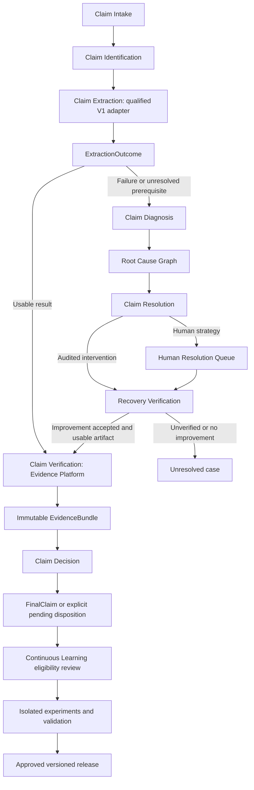
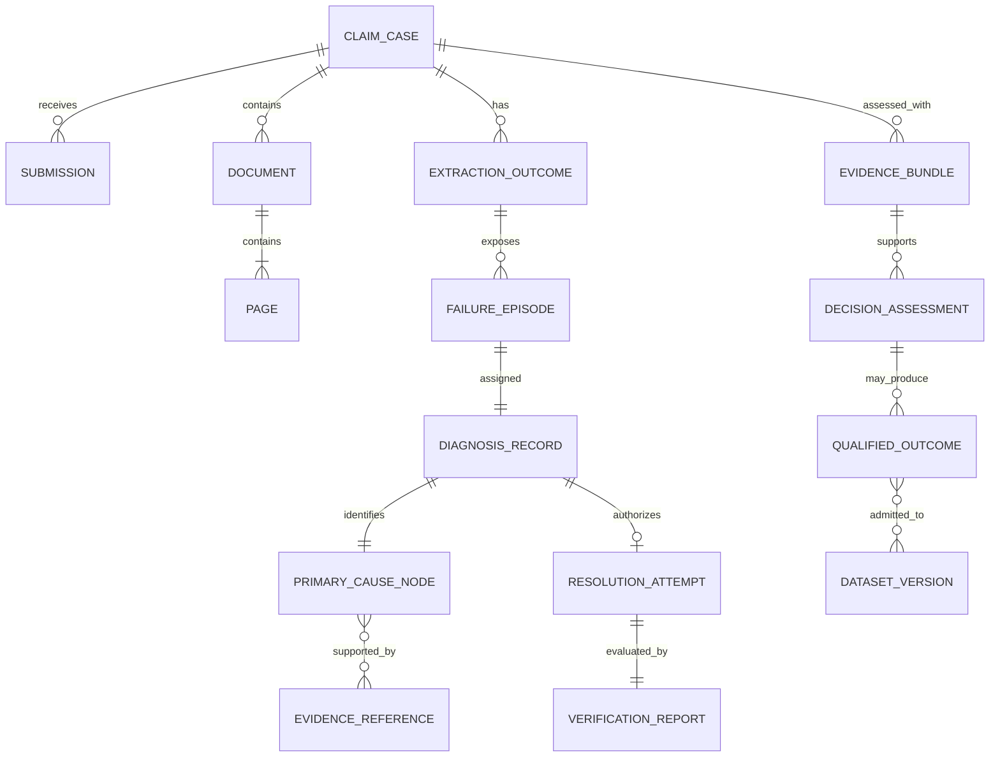
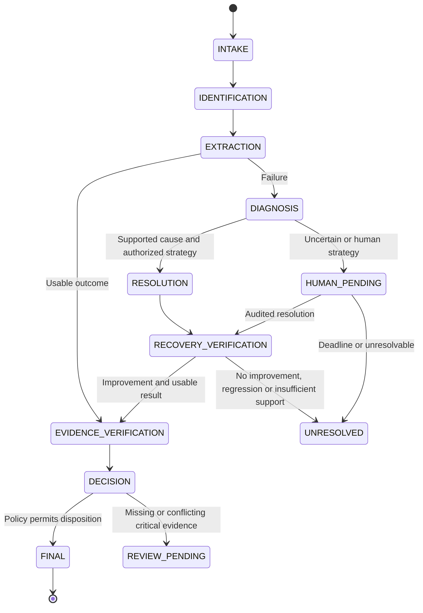
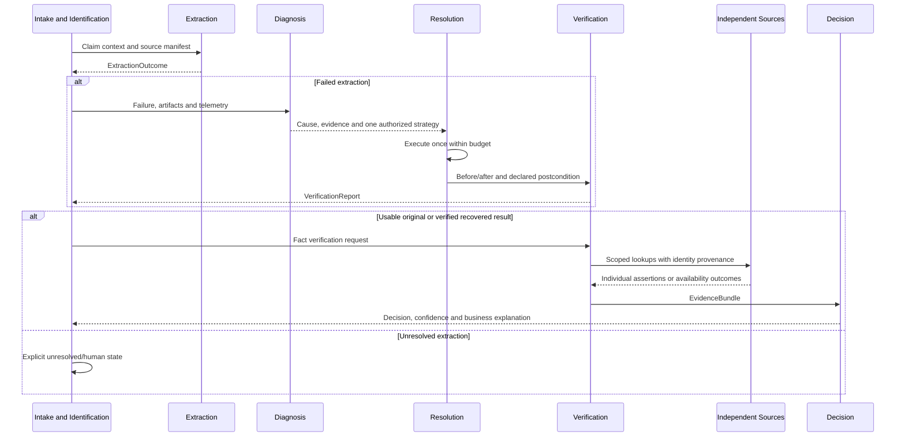
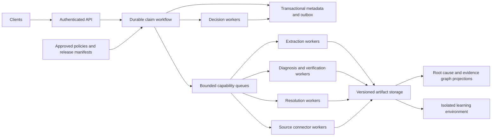

# Enterprise Claim Resolution Platform

Board and Architecture Review Board proposal | ashishdat/CDP | 14 September 2026

Status: proposed design. Planning horizon: three years. No implementation, execution, deployment or certification is implied.

## 1. Executive recommendation

Organize CDP around eight business capabilities, with a claim case as the unit of work. Retain V1 extraction behind a contract where its behavior is justified. Introduce diagnosis before recovery, a cause-specific resolution policy, explicit recovery verification, independently sourced corroboration and auditable decision intelligence.

The platform resolves claims. Registration, geometry and OCR are internal extraction mechanisms, not organizational boundaries. Their stability is valuable, but does not demonstrate that the current application supports every submitted claim.

Approve a bounded discovery and pilot investment, conditional on source access, failure-cause validation and independently measurable outcomes. Do not approve the target KPIs as guaranteed delivery estimates.

### Assumptions requiring correction

- Diagnosis cannot require a successful ExtractionResult. Failed attempts must emit an ExtractionOutcome envelope with failure, partial artifacts and telemetry references.
- One primary cause per failure is an ownership rule, not proof that reality has one cause. Preserve contributing factors and competing hypotheses; use UNDETERMINED when evidence is insufficient.
- Cross-field checks are derived consistency evidence. They are not independent corroboration when their operands come from the same extraction.
- A better safety score or a generated artifact proves only the improvement it measures. It does not prove field correctness or justify automatic claim acceptance.
- Multiplying independence, reliability, quality and agreement can produce an evidence-quality index. It does not automatically produce a calibrated probability of correctness.
- A recovered claim and a finalized historical claim are not automatically valid training labels. Their verification and source lineage must qualify them first.

## 2. Operational basis and limits

The aligned saved run `runs/anchor-normalization-100-01` records 100 claims, 284 pages, no retries and concurrency one. Its measured commit is `c6dbdea545da5a177a219a588ecbae3a67c54c41`. [AnchorNormalizationDeltaReport.json](AnchorNormalizationDeltaReport.json) records 39 final-claim completions, 27 selection-unavailable outcomes and 34 selected registration safety failures. All 39 completed claims required field review.

These are failure locations, not independently adjudicated physical causes. Selection failure does not prove a wrong template; a safety rejection does not prove a defective registration algorithm. [SelectionRootCauseReport.json](SelectionRootCauseReport.json) records 23 claims with CMS1500 anchor scores below threshold and four with a passing score but a missing required anchor. Its categories overlap. Missing UB04 assets block that route but do not identify the claims as UB04.

The architectural lesson is that the existing path stops without a general mechanism to diagnose and resolve claim-level obstacles. It is not evidence that the right response is to relax extraction controls. Missing independent evidence separately limits automatic verification; it does not explain upstream availability failures.

Observed latency was mean 48.506 seconds and P95 118.617 seconds across all attempts. Fast failures affect those figures. The stated 100% manual review refers to completed claims; report submitted-claim and completed-claim denominators separately.

## 3. Business capability map and exclusive ownership

Every business responsibility has exactly one accountable capability. Other capabilities consume its contract rather than reimplementing its responsibility. Shared hosting, security and storage are supporting services, not new claim-processing capabilities.

| Capability | Owns | Primary output | Why this improves the V1 operating model |
|---|---|---|---|
| Claim Intake | Submission integrity, access, immutable originals, duplicate-submission policy | SubmissionManifest | Separates input acceptance from extraction success |
| Claim Identification | Claim/document/page relationships, member/payer/document identity hypotheses | ClaimIdentityContext | Avoids treating an uncertain page label as a settled claim identity |
| Claim Extraction | Existing registration, geometry, OCR, ranking, validators and extraction assembly | ExtractionOutcome, optional ExtractionResult | Preserves working capability while exposing failures consistently |
| Claim Diagnosis | Failure episodes, cause assignment, supporting/refuting evidence and impact | DiagnosisRecord, RootCauseGraph | Replaces symptom-driven retries with justified actions |
| Claim Resolution | Cause-to-strategy policy, bounded execution and human resolution tasks | ResolutionAttempt | Prevents combinatorial retries and ambiguous execution ownership |
| Claim Verification | Recovery comparison, independent source acquisition, evidence bundles and fact verification | VerificationReport, EvidenceBundle | Separates artifact recovery from independent correctness evidence |
| Claim Decision | Business policy, disposition, confidence interpretation and explanation | DecisionAssessment, FinalClaim | Keeps business authority distinct from extraction and recovery |
| Continuous Learning | Qualified outcome curation, offline experiments, evaluation and candidate releases | Versioned candidate release | Prevents unverified outputs from becoming self-reinforcing truth |

Claim Verification owns the Evidence Platform and Recovery Verification Engine as separate components. Claim Resolution owns the human queue for resolving cases. Verification owns acceptance of submitted supporting evidence; Learning owns admission of that evidence into training/evaluation datasets. Claim Decision owns decision-policy governance. Claim Intake owns access/data-lifecycle policy coordination. Each release remains subject to organizational security and quality approval.

## 4. Architecture and component diagram

The diagram deliberately adds a failure envelope and a successful-extraction bypass. Requiring all claims to pass through diagnosis or recovery would add cost without solving a problem. Requiring failed claims to produce a successful ExtractionResult would make diagnosis unreachable.

The Evidence Platform does not repair extraction. It preserves external assertions and verifies applicable facts. Its connector catalog can include template history for verification; resolution-related reference recovery is owned by Claim Resolution and must be recorded as an intervention, not disguised as corroboration.

Root Cause Graph and Evidence Graph are distinct projections. The first represents diagnostic hypotheses and cause relationships; the second represents factual provenance and support/conflict. Neither creates truth. Their authoritative records are immutable, versioned domain records; a dedicated graph database is optional.

## 5. Domain model and interfaces

| Contract | Required meaning |
|---|---|
| SubmissionManifest | Tenant/claim/submission identity, original hashes, pages and authorization; file equality alone is not claim duplication |
| ExtractionOutcome | Status, result reference if present, failed prerequisite/stage, partial artifact hashes, telemetry and execution versions |
| DiagnosisRecord | Episode ID, exactly one primary cause, confidence basis, evidence, alternatives/contributors, impact and recovery candidate |
| RootCauseNode | Cause taxonomy/version, supporting and refuting references, history links, diagnosis state and ownership |
| ResolutionAttempt | Authorized strategy, prerequisites, immutable inputs, budget, start/end, changed inputs and result references |
| VerificationReport | Before/after alignment, intended improvement, observed changes, invariants, result and limitations |
| Evidence | Source, proposition/field, value, independence declaration, reliability, freshness, quality, confidence semantics and provenance |
| EvidenceBundle | All relevant observations/assertions and availability records, without voting, averaging or destructive merging |
| DecisionAssessment | Decision, claim/field confidence, review reason, missing/conflicting evidence, business explanation and version references |
| QualifiedOutcome | Verification scope, authority, lineage and explicit training/evaluation eligibility |

All contracts bind tenant, claim, execution, version and artifact hashes. Commands carry idempotency keys and budgets. Timestamps distinguish observation time, source-effective time and recording time. Missing confidence is null, not an invented zero or a default certainty.

## 6. Diagnosis Engine

Diagnosis uses the original attempt's artifacts and captured telemetry before any recovery. It performs read-only checks of identities, reference availability, source quality and contract prerequisites. Running another extraction route to see whether it works is an intervention and belongs to Resolution, not diagnosis.

One failure episode receives one primary cause for routing. Deterministic diagnosis rules require positive evidence, retain refuting observations and abstain when multiple explanations cannot be distinguished. Known prerequisite blockers take precedence over downstream symptoms only when the dependency is established. Ties remain UNDETERMINED; do not fabricate certainty to meet the one-cause schema.

| Primary cause | Evidence required to support assignment | What is insufficient |
|---|---|---|
| POOR_SCAN | Recorded readability/quality defect with visible or measured support relevant to the failure | Low OCR confidence alone |
| WRONG_TEMPLATE | Identity/layout evidence establishes incompatibility and a supported alternative | Failure of the selected template alone |
| TEMPLATE_EVOLUTION | Documented form-version difference with authoritative comparison | Missing anchor or low layout score alone |
| MISSING_ASSET | Required asset reference absent, unreadable or integrity-invalid | Generic registration rejection |
| REGISTRATION_FAILURE | Established failure in valid-source/compatible-template registration, with no better-supported cause | Treating a safety rejection as proof of algorithm defect |
| OCR_FAILURE | Valid input regions and an observed provider/recognition failure | Empty field when the page may actually be blank |
| UNKNOWN_DOCUMENT | Insufficient evidence to establish document identity | Assuming an unsupported form |
| UNSUPPORTED_FORM | Established document type outside qualified capabilities | Classifier uncertainty |
| CONTRACT_FAILURE | Missing/incompatible required artifact or identity handoff | Reclassifying it as OCR failure |
| UNDETERMINED | Evidence cannot discriminate causes | Forced assignment based on the first failed stage |

REGISTRATION_FAILURE and OCR_FAILURE are mechanism-level diagnoses when a deeper physical cause is not established. Their depth is recorded. Not every such label permits automatic recovery.

History links may inform diagnostic hypotheses but are not proof about the current page. Diagnosis confidence is evidence sufficiency or calibrated diagnostic accuracy only when applicable labeled cases exist; it is never simply the number of matching historical failures.

### Root Cause Graph

Every failure episode creates one primary RootCauseNode linked to evidence, telemetry and relevant history. Edges distinguish supports, refutes, possible-contributor and observed-dependency. A hypothesized cause is never labeled causally proven solely because it co-occurs with failure. New evidence creates a diagnosis revision rather than overwriting history.

This reconciles operational ownership with real multi-causal failures: exactly one primary node controls the current action, while uncertainty and contributors remain visible.

## 7. Cause-driven Resolution Engine

No fixed template → registration → OCR ladder. Resolution selects the single strategy authorized for the supported cause. A strategy may execute required downstream completion steps, but cannot hide multiple alternative strategies inside a loop.

| Cause | One candidate strategy | Preconditions and limits |
|---|---|---|
| POOR_SCAN | Approved image enhancement | Original retained; fixed transformation; assess information loss and preserve coordinate lineage |
| WRONG_TEMPLATE | One qualified alternative template | Existing compatible reference; current safety controls remain applicable |
| TEMPLATE_EVOLUTION | Route to an approved supported version | If unavailable, human/reference stewardship instead of inventing a template |
| MISSING_ASSET | Recover the exact authorized reference asset | Verify origin/version/hash; never substitute an arbitrary image |
| REGISTRATION_FAILURE | One previously qualified alternative registration configuration | Only where diagnosed failure is addressable; otherwise human strategy |
| OCR_FAILURE | One eligible alternative OCR provider | Valid regions and provider authorization; no crop/safety bypass |
| UNKNOWN_DOCUMENT | Human identity clarification | No speculative form assignment |
| UNSUPPORTED_FORM | Human resolution or supported-source resubmission | Do not force the claim through a known-incompatible route |
| CONTRACT_FAILURE | One approved artifact restoration/resume strategy | Complete lineage and compatible hashes; no algorithm change |
| UNDETERMINED | Human diagnostic clarification | No automated extraction retry |

A given failure episode can execute at most one recovery strategy. Rejected verification does not unlock another strategy by relabeling the same evidence. A genuinely different blocker revealed after a successful intervention may create a new episode, with fresh evidence and a separate authorization; a claim-level limit still bounds the total. Initial pilot should allow one automated intervention per claim and then explicit unresolved handling. Expansion requires measured justification.

Repeated delivery is idempotent. Transport retries, if permitted, are bounded inside the attempt budget and do not restart the strategy. Human queue entry is pending work, not successful recovery. Human clarification can create a revised case, but cannot reset budgets automatically.

## 8. Verification Engine: prove the stated improvement

Before executing resolution, record the expected postcondition and invariants. After execution, compare the same source case and declared intervention. Never select the comparison metric after seeing the result.

| Verification layer | Required test | Meaning of a pass |
|---|---|---|
| Integrity | Tenant/claim/page lineage, hashes, coordinate frame and artifact compatibility | Results belong to the same case |
| Cause-specific improvement | Declared blocker resolved: asset restored, compatible identity, provider returns required output | Intervention addressed the diagnosed obstacle |
| Extraction availability | Existing contract satisfied and required completion steps executed | A usable result exists |
| Non-regression | Required safety/validation controls remain satisfied; unintended changes exposed | No observed invariant violation |
| Independent correctness | Applicable authoritative or adjudicated facts support recovered values | Verified only within the supported fact scope |

VerificationReport outcomes: IMPROVEMENT_PROVEN, NO_IMPROVEMENT, REGRESSION or INSUFFICIENT_EVIDENCE, plus a separate correctness-verification scope. Producing an ExtractionResult can prove availability improvement without proving critical-field accuracy. A safety score increase alone cannot establish a correct recovery.

Only a usable result with accepted operational improvement proceeds as recovered extraction. Independent verification may still require review. Preserve raw and changed artifacts, negative findings, before/after values, comparator version and limitations. No silent recovery and no automatic learning admission.

## 9. State machines and sequence

Identification uncertainty is retained in context; an unprocessable identity failure can enter diagnosis without running extraction. Review amendments create new immutable assessments; the diagram does not imply endless case retries.

## 10. Evidence Platform and Decision Intelligence

The Evidence Platform belongs to Claim Verification. It preserves source assertions independently and does not repair extraction, vote or average. Derived extraction observations remain available as context, but are not admitted as independent corroboration.

| Source | Useful evidence | Independence boundary |
|---|---|---|
| Provider Registry | Provider identity and source-supported participation/attributes | A directory mirrored from NPI is not a second source |
| Historical Claims | Independently finalized prior facts and amendments | Exclude CDP predictions and unreviewed source echoes; prior services do not prove current services |
| Member Registry | Demographics, membership and coverage with effective dates | Correct identity binding remains necessary |
| NPI Registry | Assigned identifier and source-supported provider attributes | Not proof of current service or payer participation |
| ICD / CPT | Applicable versioned code facts | Code validity is not clinical/service truth; source entitlement required |
| Payer Rules | Authorized, dated normative requirements | Rules constrain a claim; they do not independently observe events |
| Template History | Authoritative version facts | Supports applicability; does not establish extracted values |
| Master Data | Named authoritative enterprise domains | May share upstream origins with other connectors |
| Cross Field Rules | Consistency and contradictions between operands | Derived checks; independence is NOT_ESTABLISHED or DEPENDENT when operands share extraction |

Every assertion declares independence status and basis, source authority scope, reliability method, freshness/effective interval, provenance, quality and confidence semantics. Independence declarations must be supported by lineage; a boolean flag is not proof. Identical source records reused through multiple connectors remain one origin for that fact. No evidence is counted twice because it has multiple wrappers.

Registry lookups can use extracted keys, but must retain their origin, ambiguity and matching evidence. External origin does not eliminate wrong-record risk. NO_MATCH, AMBIGUOUS, UNAVAILABLE, UNAUTHORIZED, STALE and CONFLICT are distinct; no record does not prove a value false without a completeness guarantee.

### Confidence semantics

Retain the requested conceptual relationship:

**EvidenceQualityIndex = Independence × Reliability × Quality × Agreement.**

This is a versioned assessment index, not automatically ClaimConfidence or a probability. All factors must have documented definitions, source references and applicable scales. Unknown factors produce UNKNOWN/null, not guessed defaults. Binary independence eligibility can gate admission; a fractional independence measure needs validated meaning before use. Quality includes identity and temporal applicability through explicit checks rather than an undocumented extra weight.

Evaluate eligible assertion relationships or authority-supported fact assessments separately. Do not sum, average or vote across evidence records. Multiple agreeing OCR observations do not increase independence. A single authoritative source can support a fact even when no multi-source agreement measure is available; agreement must name the comparison being assessed and cannot assume missing peers agree.

The four factors can be correlated, so their product is not a calibrated correctness probability. ClaimConfidence and FieldConfidence include assessment state, scope, evidence-quality profile and nullable calibrated probability. A numerical probability requires an independent evaluation/calibration cohort and a pinned method. Do not average field probabilities into claim probability.

Decision consumes EvidenceBundle plus approved policy and returns claim decision, claim/field confidence, missing evidence, conflicting evidence, review reason and a business explanation. Explanations are deterministic templates over actual rule evaluations and source references. No LLM generates facts, rules or reasons after the event.

Authority precedence resolves conflicts only where an approved domain policy specifies it. Otherwise preserve the conflict and review requirement. Distinguish correct extraction from correct business disposition. External records may corroborate identity without proving the billed service occurred.

## 11. Continuous Learning and truth governance

Learning is offline and versioned. Eligible inputs include verified outcomes, human adjudication, recovered claims and history only after source/verification review. Recovery membership or finalized status alone does not qualify a label.

Use three classes: source-attested facts within their authority scope; independently adjudicated facts; and silver labels with explicit uncertainty. Silver labels can support experimentation but are not certified ground truth. Training outputs and model agreement never promote themselves into truth.

Process: outcome eligibility review → versioned dataset → entity/time/source-aware splits → candidate experiment → independent evaluation → quality/security/policy approval → shadow/canary → controlled release. Keep holdouts isolated from runtime references. Record source overlap between evaluation labels and runtime evidence; otherwise apparent accuracy can merely measure agreement with the same database.

No automatic production learning, source-based threshold changes or autonomous deployment. Human corrections preserve original evidence and amendment lineage. A reviewer agreeing with a suggested answer is not necessarily independent verification. Use authoritative records and targeted adjudication to avoid large indiscriminate labeling campaigns; retain a small independent audit of apparent agreement to detect shared errors.

Each release pins code, models, templates, source contracts, policy and calibration versions. Maintain rollback and audit. Drift triggers investigation or a candidate experiment; it never authorizes an unreviewed production change. Reassessment after rollback creates revisions rather than deleting decisions.

## 12. Deployment and scalability model

Logical capability ownership does not require one microservice per capability. Begin with an API/workflow deployment, separately scalable extraction/connector pools, a human workflow integration and isolated learning. Reuse existing infrastructure only after it satisfies contracts; avoid a new graph database or orchestration framework without a demonstrated need.

Use transactional metadata for case/attempt state, object storage for large immutable artifacts, and rebuildable graph/search projections. At-least-once transport with idempotency and a transactional outbox gives one logical publication without claiming exactly-once network delivery. Leases protect attempt ownership; duplicate delivery does not trigger duplicate recovery.

Start single-region multi-zone with tested backup/restore, then add regional isolation only for measured scale/residency/recovery needs. Tenant quotas, source rate limits, queue-age alarms and backpressure protect shared capacity. Isolate CPU/GPU extraction from connector I/O. Cache only with tenant, source-version, identity and effective-date scope.

Capacity planning uses arrival rate × mean work per claim / target utilization, refined by recovery frequency and measured distributions. If a fraction f enters one recovery strategy of mean additional work r, average work includes f × r, not all possible strategies. Human handling capacity uses arrival rate into the queue × average handling time, with staffing and SLA buffers. Source quotas can dominate throughput regardless of compute capacity.

No unlimited parallel alternatives. The resolution contract selects one strategy; scaling increases simultaneous independent claims, not speculative strategies for a single claim.

## 13. Governance, security and monitoring

Capability owners approve their domain policies; an architecture/release board approves cross-capability contracts. Separate policy/model authors from production approvers. Source owners attest authority and update semantics; quality owners approve verification and evaluation; operations owns deadlines and recovery procedures.

Maintain immutable audit links from submission through diagnosis, resolution, verification, bundle, decision and release. Root-cause taxonomy changes are versioned. A revised diagnosis does not erase the original attribution. Every operational report states denominator, cohort, version and missing-data coverage.

Tenant-scoped authorization covers lookups, caches, artifacts, projections and training exports. Encrypt transport/storage, isolate secrets, minimize PHI in logs and restrict egress. Treat documents and connector payloads as untrusted data; isolate parsing and bound file/resource usage. No retrieved text becomes executable instruction.

Source entitlements, permitted use, residency, retention, deletion and legal holds require organizational review. Immutable lineage is not permission for indefinite PHI retention. Support governed payload lifecycle and lawful audit retention. Monitor supply-chain/model/source integrity and quarantine compromised versions; identify affected decision revisions for controlled reassessment.

Monitoring captures events as execution occurs. Track intake integrity, identity ambiguity, extraction availability, diagnosis abstention, cause frequency, strategy attempts, verified recovery yield, regression findings, source applicability, conflicts, decision outcomes, costs and queue delay. Never reconstruct missing telemetry as observed history.

Cause accuracy and cause-specific strategy yield are different metrics: an intervention may fail despite a correct diagnosis. Avoid teaching diagnosis solely from whether a recovery succeeded.

## 14. KPI contract and feasibility

| KPI | Target | Denominator / interpretation |
|---|---|---|
| Operational completion | 90% | Substantive final outcomes / all accepted claims; pending/error envelopes excluded |
| Extraction availability | 90% | Usable scope-complete results / all accepted claims; selected-page coverage reported separately |
| Auto verification | 60% | Proposed: independently verified eligible fields / all eligible fields, including missing fields; claim-level all-critical verification separate |
| Manual review | <20% | Claims touched by humans / all accepted claims, including diagnostic/recovery tasks; minutes also reported |
| Critical field accuracy | >98% | Independently evaluated correct critical fields / evaluated critical fields, with label coverage and uncertainty |
| Mean machine processing time | <20 seconds | Intake-to-machine assessment including queue/recovery; human resolution time separate |
| P95 machine processing time | <60 seconds | Same start/stop and population as mean; pending acknowledgement is not completion |

If the latency targets include human resolution, staffing and feasibility require separate approval. Do not make slow claims disappear from metrics by moving them to a queue.

On a strictly sequential route, overall completion is extraction availability multiplied by downstream completion conditional on a usable result. At 90% extraction availability, 90% operational completion leaves no downstream failures. Plan headroom: for example, 95% availability × 95% downstream completion = 90.25%. These are arithmetic scenarios, not forecasts.

Likewise 60% field verification does not imply <20% claim review: one unresolved critical field can affect every claim. Agree the unit of auto verification before evaluating targets. Returning rejection solely to reduce human review is prohibited by the metric contract; report false rejection and disposition mix.

An initial machine budget might allocate 2 seconds intake/identity, 8 extraction, 5 additional evidence/diagnosis wait after overlap, 2 decision/publication and 3 reserve. This is a planning budget, not measured capability. Recovery costs must fit the remaining deadline or be reported separately as extended processing. End-to-end P95 must be measured; stage percentiles cannot simply be added.

## 15. Migration strategy

1. Freeze a reproducible V1 release and client contract baseline; separate uncommitted work from release artifacts.
2. Introduce the business-capability facade and ExtractionOutcome adapter without changing V1 algorithm behavior. Failed outcomes become diagnosable even without ExtractionResult.
3. Build diagnosis in shadow mode against captured failures. Evaluate primary-cause assignments against source-supported reviews before allowing automated interventions.
4. Enable one cause/strategy pair in a bounded cohort, with predeclared verification and a claim-level attempt cap. No fixed fallback ladder.
5. Connect independent sources and evidence-preservation contracts. Qualify identity, lineage, freshness and conflicts before decisions consume them automatically.
6. Shadow decision intelligence; preserve V1 publication authority until policy, accuracy and compatibility gates pass.
7. Canary per tenant/form with one publication owner per claim revision. Use additive schemas, asynchronous backfill and explicit in-flight draining.
8. Expand or retire V1 capabilities individually based on verified value. Preserve rollback capacity and historical replay.

No planned production downtime is the migration objective. It is not a guarantee against dependency outages. Rollback stops future V2 publication; already issued external decisions require amendments, not silent deletion. Earlier stored artifacts remain immutable and attributable.

## 16. Risk analysis

| Risk | Consequence | Control |
|---|---|---|
| Forced single-cause certainty | Wrong intervention | One primary assignment with abstention, competing evidence and revisions |
| Diagnosis becomes disguised retry | Hidden cost and unsafe search | Read-only diagnosis; interventions exclusively owned by Resolution |
| Cause relabeling bypasses attempt limit | Endless recovery | Episode and claim-level caps; new evidence required for new episode |
| Verification uses convenient post-hoc metric | False recovery success | Predeclared improvement and invariant checks |
| Confidence product treated as probability | Unsupported automation | Typed index, null uncalibrated probability and independent calibration |
| Cross-field/history evidence counted independently | Circular verification | Assertion-level lineage and explicit derived status |
| Recovered outputs become labels automatically | Learning feedback loop | Eligibility review, independent verification and isolated holdouts |
| Source unavailable/stale/wrong identity | Incorrect decisions or low coverage | Explicit availability/applicability outcomes and identity controls |
| Human queue grows | Cost and latency exceed targets | Bounded intake, staffing, deadlines and unresolved outcomes |
| Duplicate publication during migration | Duplicate downstream actions | Single owner, outbox and reconciliation |
| PHI/tenant/source-rights violation | Security/business exposure | Access isolation, egress restrictions and source lifecycle governance |

## 17. Cost model and ROI

For monthly volume N, failure-cause fraction f_c, authorized-strategy invocation fraction a_c and full strategy cost k_c, automated resolution cost is N × sum(f_c × a_c × k_c). Each k_c includes required extraction completion and verification, not just the alternative operation. Add diagnosis, independent source lookups, human handling, storage, monitoring and governance costs.

One strategy per cause bounds cost better than attempting every alternative. It does not guarantee a cheaper claim: diagnosis overhead and new evidence sources may exceed saved retries. Measure cost per submitted claim, verified recovered claim and correctly completed claim.

Monthly net value = contribution from additional correctly completed claims + avoided manual/rework labor − additional machine/source/human/operating cost − expected error loss. Avoid double-counting the same saved reviewer work. Payback requires a positive measured monthly net value; current evidence does not support a dollar forecast.

If the original 39 successes remain successful, reaching 90 requires 51 additional completions from 61 failures: **83.6% conversion**. Let r be the fraction of current failures resulting in verified end-to-end recovery; completion becomes 39 + 61r percent. At r=0.5 it is 69.5%; at r=0.7 it is 81.7%; at r=0.85 it is 90.85%. These are sensitivity scenarios, not estimated yields. Actual cause-level recoverability is not yet measured.

Prioritize investment in diagnosis evidence, independently available source facts and the cause/strategy pair with the best measured incremental correctly completed claims per cost. Do not rank by raw cause count alone: frequent unsupported forms may be expensive and unrecoverable automatically, while a missing authorized asset can be narrowly addressable. No specific pair has a proven ROI from the current aggregate data.

HITL savings require measuring all human touches and minutes, including diagnosis and recovery. Critical-field accuracy and false decisions constrain automation; source agreement alone cannot justify savings forecasts.

## 18. Engineering roadmap and three-year evolution

| Horizon | Delivery | Exit gate |
|---|---|---|
| Months 0–3 | Capability ownership, outcome contract, root-cause taxonomy, source access, KPI/verification protocol | Failed claims diagnosable without result fabrication; source and cause evidence limits documented |
| Months 3–6 | Read-only diagnosis, root-cause graph, one bounded cause/strategy pair and recovery verification | Supported diagnoses, one strategy, measured improvement and no invariant regression |
| Months 4–9 | Independent source connectors, assertion lineage and evidence bundles | Relevant authorized facts with identity/freshness controls |
| Months 7–12 | Decision intelligence, confidence semantics and bounded canary | Policy-compatible decisions with independently evaluated errors |
| Months 10–18 | Qualified outcomes, learning eligibility, versioned experiments and review workflow | No circular labels or automatic production learning |
| Months 15–24 | Scale, operational resilience, additional proven cause/strategy pairs and migration | Completion/review/cost/accuracy gates by scope; tested rollback |
| Months 24–36 | Broader payer/form/source coverage and operational economics | Each expansion has verified marginal value; regional expansion only where justified |

Year 1 proves a bounded resolution product; year 2 broadens reliable coverage; year 3 improves reach and economics. Truth governance and source access begin immediately rather than waiting for learning infrastructure.

Indicative bounded first-production scope, assuming reusable extraction and accessible structured sources:

| Workstream | Engineer-weeks |
|---|---:|
| Capability/outcome contracts and release foundation | 10–16 |
| Diagnosis, cause records and evidence rules | 12–20 |
| Resolution control and verification | 12–20 |
| Initial independent source portfolio | 16–26 |
| Decision and confidence integration | 10–18 |
| Learning eligibility and evaluation | 10–18 |
| Security, operations, migration and hardening | 12–20 |
| **Total** | **82–138** |

These planning ranges exclude procurement delay, broad payer-rule authoring, large source remediation and three years of operation/expansion. A core 6–8 engineering team needs named claim-domain, data-owner, quality, security and operations participation. Calendar gates include external access and independent evaluation; do not divide effort by headcount to promise a delivery date. Re-estimate after the first 90 days and first cause/strategy pilot.

## 19. Architecture decisions and board approval conditions

| Decision | Reason relative to V1 |
|---|---|
| Business-capability ownership | Keeps orchestration and business accountability separate from implementation engines |
| ExtractionOutcome beside ExtractionResult | Makes the 61 incomplete outcomes addressable without inventing success |
| Diagnosis before resolution | Prevents symptom-driven alternatives and makes intervention rationale reviewable |
| One primary cause with uncertainty | Provides actionable ownership without hiding multi-causal evidence |
| One strategy plus verification | Bounds spending and distinguishes actual improvement from another execution |
| Independent assertions plus derived constraints | Prevents repeated OCR/rule agreement from becoming false truth |
| Typed confidence and policy explanation | Makes decision authority and uncertainty auditable |
| Qualified offline learning | Prevents production mistakes from becoming training truth |
| Immutable records and graph projections | Preserves replay without making graph infrastructure the business authority |

Approve the initial scope, source owners, diagnosis evidence criteria, primary-cause abstention policy, per-claim budgets, verification postconditions, confidence semantics, KPI denominators and publication authority. Establish acceptable false-accept/false-reject limits and independent evaluation coverage before automatic decision activation.

The platform's success is verified claim resolution, not more extraction attempts or larger evidence graphs. This design proposes a causal accountability chain from failure evidence to a bounded intervention, measured improvement, independent corroboration and an explainable business decision.

## Scope record

This document responds to the attached first-principles business-capability request. Existing operational reports are used only for their recorded aligned cohort facts. No code, runtime configuration, algorithms, thresholds, claims, benchmarks, commits or pushes were changed or executed. Implementation and production approval remain separate work.
