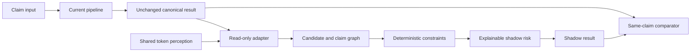

# CDP 2.0 shadow architecture slice

This slice extends `packages/claim_intelligence` on the authoritative
`ashneevai/CDP` branch `architecture/cdp2-claim-intelligence`, starting at
`5063c348093253b49d546e1d1f457f72b1db9de3`.

`run_after_legacy(legacy_runner, pages)` executes the supplied current pipeline
once, adapts its canonical claim and evidence, and evaluates an isolated graph
copy. It returns the original canonical object beside a shadow comparison.
Shadow exceptions produce a PHI-free failure code and do not interrupt canonical
delivery. Production values, field dispositions, HITL and claim STP are not
written by this integration. Neither shadow result type can be constructed with
production authority enabled.



The document adapter retains OCR text only in memory, with page geometry and
source-region lineage. It adapts the existing OCR token contract. Spatial
extraction reuses the governed field-definition registry, exact anchors,
anchor-relative regions, line order and neighbor exclusions. Alternative
candidates survive; names and ICD characters are never fuzzy-corrected.

The invocation ledger reuses successful full-page perception by an immutable
input key and rejects changed keys. Regional calls require unresolved fields.
RapidOCR and the existing production OCR policy are unchanged. The operational
runner validates source assets, rendered pages, cache provenance and frozen cache
content before consuming cached RapidOCR observations.

Arithmetic proof now requires an explicit complete line inventory, unique line
IDs and source regions, readable charges, unambiguous signs, supported currency
and complete provenance. The original arithmetic test now declares those
prerequisites explicitly. Missing chronology remains UNKNOWN. Unusual ages request
review. Diagnosis pointers, NPI syntax and explicit patient/subscriber relationships
are evaluated without inferring absent relationships. Repeated agreement uses the
existing provenance-independence predicate, including same-crop and same-region
rejection; distinct engine names or group labels are insufficient.

Risk scoring uses geometry, anchors, structure, formatting, claim constraints,
independent evidence, criticality and authority. OCR confidence alone cannot
produce ACCEPT_SHADOW. A confidently extracted identity may still require
AUTHORITATIVE_NOT_AVAILABLE review. Conflicts always force review.

The configured ICD reference provider is disabled and no governed local ICD
snapshot is installed in this checkout. Diagnosis therefore uses syntax only;
no reference source or production authority was activated. Azure is optional and
unused in this run. Its bounded-response adapter accepts only existing candidate
IDs or NONE; contracted pricing remains unconfigured for this invocation.

## Running the comparison

```powershell
python -m evaluation.cdp2_comparison
```

The same-claim comparison executes the current `EvidenceReconciler` against
frozen field observations and passes the same candidates to the new shadow
pipeline. It covers 20 claims, 20 observed page hashes and 130 target fields.
Embedded truth/exactness labels are excluded from both input paths. This is a
decision-layer replay, not a fresh end-to-end production extraction benchmark.
The frozen source lacks verified form identity, token arrays and complete
service-line evidence, so the new path must not manufacture those prerequisites.

Technical blocker counts represent failed engineering checks. Technical and
evidence HITL counts represent distinct fields, with total HITL counting their
union. External-authority blockers remain visible and cannot be cleared by
technical extraction support. Engineering unlockability is not production STP.

Latency compares current replay with current replay plus incremental shadow
work, as required by the strangler architecture. It does not compare a small
incremental shadow duration to the complete legacy pipeline. Fresh OCR stages are
null when cached perception was used. The historical 51.8-second OCR P95 and the
new cached timings are not comparable; none of the fresh-OCR 15/8/5-second targets
is claimed as achieved.

A separate 100-page operational replay uses the discovered real corpus of 1,000
TIFF assets, 2,173 pages and 110 packages. It measures current strict routing and
spatial candidate generation, not claim accuracy. About 150 pages are selected
for blind review with entire operational-sample packages excluded. The blind
view is exported separately as `active_learning_blind_manifest.json` and contains
only hashed linkage IDs. Share that file with blind reviewers; the main selection
manifest is for operators and includes selection metadata. Real
claim unlock distance, field ambiguity and governed image-quality bands are
unknown and are not invented for selection. Frozen-claim package lineage is not
available, so overlap with that separate regression cohort cannot be certified;
these selections are not release holdout truth.

PHI-safe runtime artifacts are generated under `evaluation_results/cdp2/`.
Only reviewed aggregate snapshots are committed under `docs/cdp2/`. Raw OCR,
source images, token data and runtime caches remain outside Git. No production
promotion is performed even if a future comparison finds an engineering benefit.
