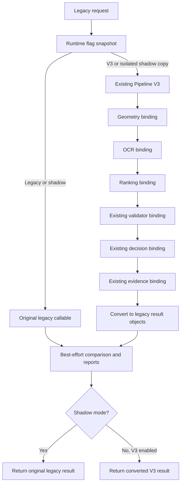

# Runtime integration work in progress

The runtime dispatch and composition boundary is implemented in
`packages_v3/runtime`. Production multi-worker integration is not complete.
No worker, database schema, event payload, validator, decision service, evidence
service, geometry engine, OCR provider, ranking policy, or benchmark is changed.

## Current boundary

`LegacyAdapter.for_claim` binds the existing geometry, OCR and ranking objects
through request builders and result mergers supplied by the composition root.
All six legacy stage callbacks must be supplied. It does not implement or copy
validation, decision, or evidence algorithms. `RuntimeIntegration` executes
these bindings through the existing Phase 1 `ExtractionPipeline`.

`RuntimeDispatcher.execute` takes the unchanged legacy request, an immutable
`RuntimeFlags` snapshot, and a diagnostic request ID. The legacy result object
is returned unchanged in legacy and shadow modes. The adapter's converters
are responsible for restoring legacy field/result objects in active V3 mode.

This diagram describes the implemented composition boundary, not the current
production worker flow. The actual validation worker builds claim evidence
before field/claim decisions. A production binding must preserve those existing
dependencies and must not reorder them to match diagram labels.

## Feature flag matrix

| Flag | Default | Effect |
| --- | --- | --- |
| FEATURE_PIPELINE_V3 | false | Return the converted V3 result when shadow is off |
| FEATURE_PIPELINE_V3_SHADOW | false | Run both paths on isolated input; always return legacy |
| FEATURE_GEOMETRY_V3 | false | Select bound V3 geometry instead of legacy geometry |
| FEATURE_OCR_ROUTER_V3 | false | Select bound V3 OCR instead of legacy OCR |
| FEATURE_CANDIDATE_RANKING_V3 | false | Select bound V3 ranking instead of legacy ranking |
| FEATURE_VALIDATORS_V3 | false | Reserved; both values reuse legacy validators |

Shadow takes precedence if both pipeline switches are true. Module switches
alone never activate the pipeline. Missing enabled V3 bindings are failures,
not successful no-ops. Flags are parsed explicitly with
`RuntimeFlags.from_mapping`; no worker reads these flags yet.

## Isolation and diagnostics

Shadow input is copied before calling legacy, so legacy mutations cannot leak
into shadow input. Shadow and comparison failures preserve successful legacy
responses. Legacy exceptions and active-V3 exceptions propagate unchanged;
there is no automatic retry that could duplicate side effects. A caller retry
is a new execution. Existing worker idempotency remains authoritative.

Shadow requires an explicit `shadow_safe` binding assertion. This is not a
sandbox: supplied callbacks must be in-memory operations and must not write to
the production database or publish events. Production persistence remains a
separate composition responsibility.

Every invocation attempts to emit comparison, coverage, and latency reports.
Missing observations are `unavailable`, not parity passes. Unbound stages are
`skipped`, not counted as executed. Legacy opaque-call coverage is unknown;
the dispatcher does not fabricate per-stage execution evidence. Reports omit
raw values and exception messages. Report sink failures do not fail requests.

## Remaining multi-worker integration

Extraction persists fields and emits `extraction.completed`. Validation reloads
those fields, constructs the claim, invokes existing validators and decision
services, and persists statuses and retry/outbox records. Calling those workers
again directly for shadow would duplicate production writes.

The production adapter therefore still needs an isolated shadow-field transport
between workers and a side-effect-free binding of the existing claim lifecycle.
The transport choice is pending: existing object storage keyed by document and
correlation IDs, or an explicitly permitted internal event payload extension.
Until that is selected, no production hook, cross-worker parity claim, rollout,
or runtime-integration completion is implied by these files.
